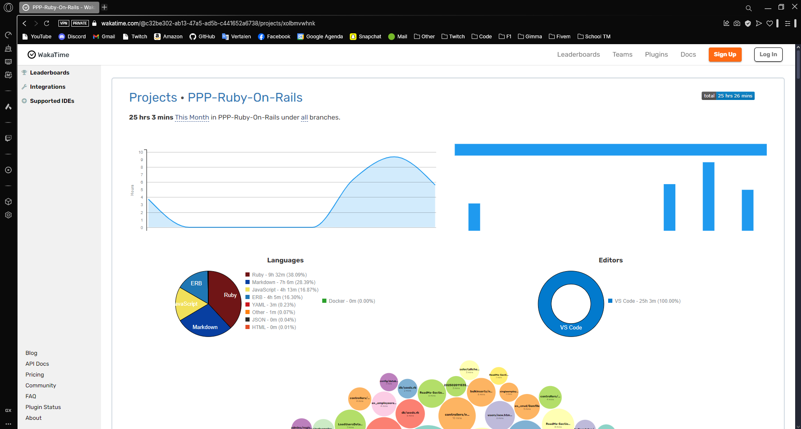

---
[🏠 Terug naar Hoofdpagina](./ReadMe.md)
---

# 🚀 Mastering Ruby on Rails

Hey! Dit is mijn repository waarin ik mijn leerproces tijdens het volgen van een **Ruby on Rails**-cursus heb bijgehouden. Hier kun je zien welke onderwerpen ik heb behandeld en wat ik allemaal heb geleerd.

---

## 📚 Wat zit erin?

### 🔧 **Setup & Configuratie**

-   📌 [Instalatie - 1 + 2](./readme/ReadMe-Section-1-2.md)
-   🛠️ [Configuratie DB - 7 + 8 + 9](./readme/ReadMe-Section-7-8-9.md)
-   📂 [Migrations - 14](./readme/ReadMe-Section-14.md)
-   📂 [Migrations 2.0 - 18](./readme/ReadMe-Section-18.md)

### 🏗️ **Architectuur & Debugging**

-   🎭 [MVC - 3](./readme/ReadMe-Section-3.md)
-   🐞 [Debugging - 4 + 5 + 6](./readme/ReadMe-Section-4-5-6.md)

### 📝 **CRUD & Datamanagement**

-   ✏️ [CRUD - 10 + 11](./readme/ReadMe-Section-10-11.md)
-   🔗 [Model Relaties - 12 + 13](./readme/ReadMe-Section-12-13.md)
-   📊 [Bulk CRUD - 15 + 16 + 17](./readme/ReadMe-Section-15-16-17.md)
-   🔢 [Input Fields Calculation - 21 + 22 + 23](./readme/ReadMe-Section-21-22-23.md)
-   💳 [Transaction - 26](./readme/ReadMe-Section-26.md)

### 🛒 **Geavanceerde Functionaliteiten**

-   🛍️ [Shoppingcart - 19](./readme/ReadMe-Section-19.md)
-   📑 [Pagination - 20](./readme/ReadMe-Section-20.md)
-   🔎 [Filtering - 24](./readme/ReadMe-Section-24.md)
-   ⚙️ [Callbacks on Model - 25](./readme/ReadMe-Section-25.md)

---

## ⏳ WakaTime Statistieken

Hieronder een overzicht van de tijd besteed aan dit project:

---

## 📜 Certificaat van voltooing:

Hieronder het certificaat van het voltooien van deze cursus:

## 🎓 Credits

Deze repo is gebaseerd op de course van **[Kameswara Sarma Uppuluri](https://www.udemy.com/user/ksarma/)**.  
Veel dank voor de waardevolle kennis en inzichten!

📌 **Check de course hier** 👉 [Klik hier](https://www.udemy.com/course/rubyonrails7)
