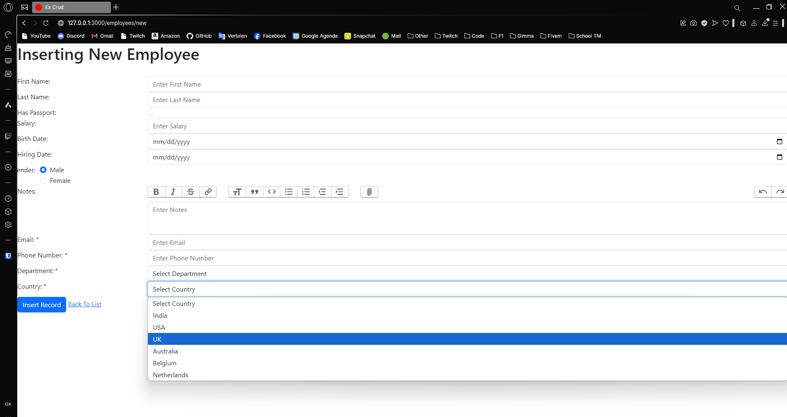
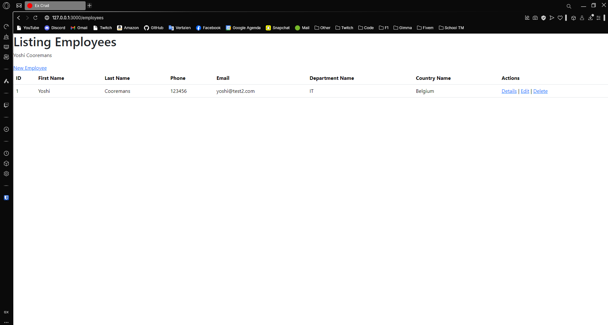
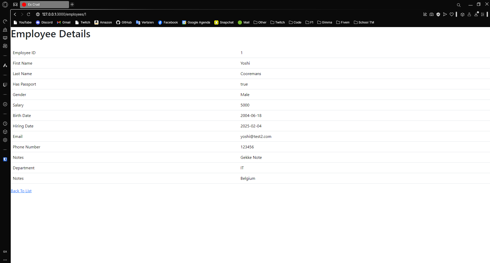
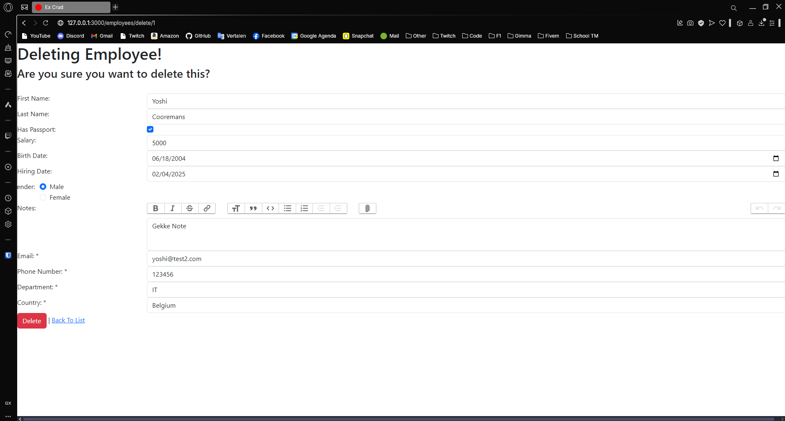
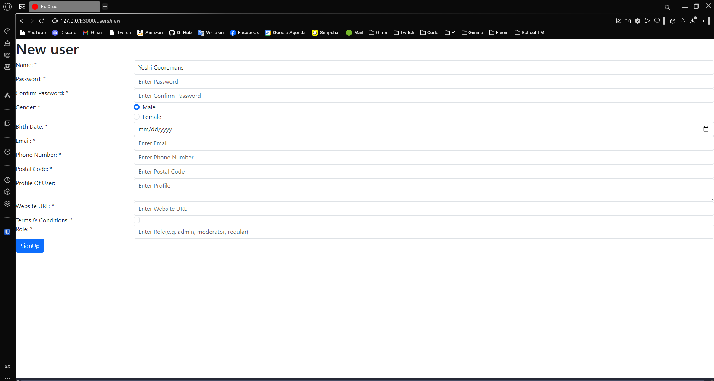
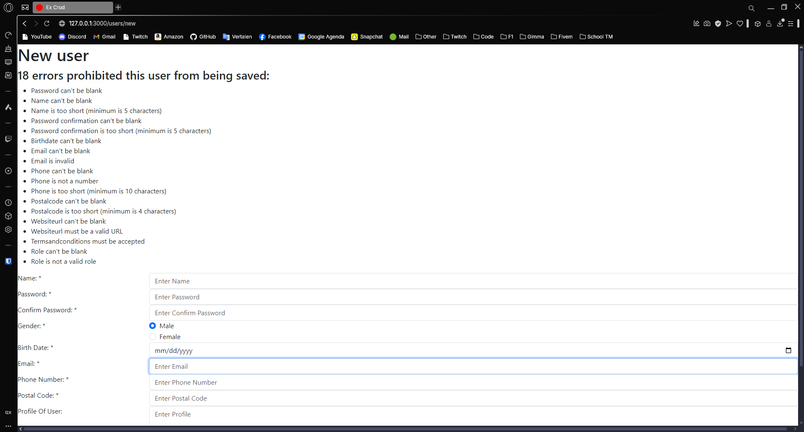
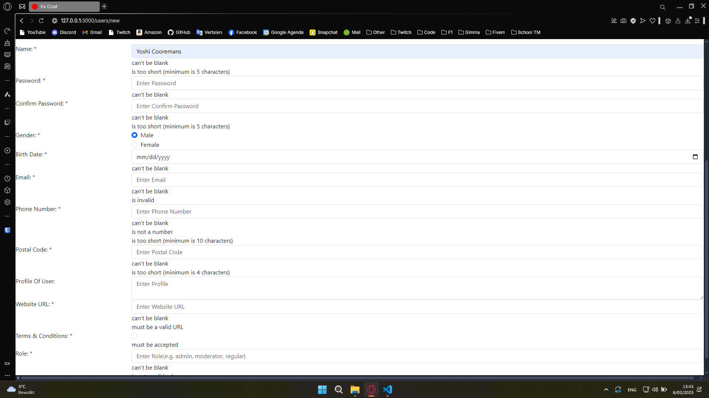
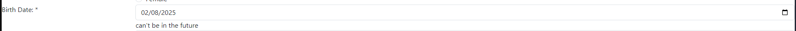

---
[⬅️ Vorige](./ReadMe-Section-10-11.md) • [🏠 Terug naar Hoofdpagina](../ReadMe.md) • [Volgende ➡️](./ReadMe-Section-14.md)
---

# Sectie 12

## 1. Aanmaken van nieuwe modellen

Het aanmaken van nieuwe modellen met de rails command:

```ps
PS C:\Users\denyo\Desktop\TM- Cursus\Fase 3\PPP\PPP-Ruby-On-Rails\exercises\ex_crudwithjoins> rails generate model department name:string
      invoke  active_record
      create    db/migrate/20250206114356_create_departments.rb
      create    app/models/department.rb
      invoke    test_unit
      create      test/models/department_test.rb
      create      test/fixtures/departments.yml
PS C:\Users\denyo\Desktop\TM- Cursus\Fase 3\PPP\PPP-Ruby-On-Rails\exercises\ex_crudwithjoins> rails generate model country name:string
      invoke  active_record
      create    db/migrate/20250206114415_create_countries.rb
      create    app/models/country.rb
      invoke    test_unit
      create      test/models/country_test.rb
      create      test/fixtures/countries.yml
PS C:\Users\denyo\Desktop\TM- Cursus\Fase 3\PPP\PPP-Ruby-On-Rails\exercises\ex_crudwithjoins> rails db:migrate
== 20250206114356 CreateDepartments: migrating ================================
-- create_table(:departments)
   -> 0.0038s
== 20250206114356 CreateDepartments: migrated (0.0045s) =======================

== 20250206114415 CreateCountries: migrating ==================================
-- create_table(:countries)
   -> 0.0036s
== 20250206114415 CreateCountries: migrated (0.0040s) =========================

```

## 2. Database seeden

Het seeden van data door de seeds.rb

```rb

unless Department.blank?
  Department.create!(name: "HR")
  Department.create!(name: "IT")
  Department.create!(name: "Finance")
  Department.create!(name: "Shipping")
end

unless Country.blank?
  Country.create!(name: "India")
  Country.create!(name: "USA")
  Country.create!(name: "UK")
  Country.create!(name: "Australia")
  Country.create!(name: "Belgium")
  Country.create!(name: "Netherlands")
end

```

## 3. Foreign Keys aanmaken

Aanmaken van Foreign keys:

```ps

PS C:\Users\denyo\Desktop\TM- Cursus\Fase 3\PPP\PPP-Ruby-On-Rails\exercises\ex_crudwithjoins> rails generate migration add_country_to_employee country:references
      invoke  active_record
      create    db/migrate/20250206115150_add_country_to_employee.rb
PS C:\Users\denyo\Desktop\TM- Cursus\Fase 3\PPP\PPP-Ruby-On-Rails\exercises\ex_crudwithjoins> rails generate migration add_department_to_employee department:references
      invoke  active_record
      create    db/migrate/20250206115216_add_department_to_employee.rb

```

## 4. Dropdown van de country en department:



## 5. Alle data weergeven met de Foreign Keys

Dit kun je doen door de juiste relaties te zetten in de models.



## 6. Andere CRUD operaties afwerken.





# Sectie 13

## 1. Validaties opzetten

Nieuwe model aangemaakt

```ps

rails generate model user name:string password:digest gender:string birthdate:date email:string phone:string postalcode:integer websiteurl:string termsandconditions:boolean role:string notes:string

```

## 2. Actions en Views aanmaken

Aanmaken van een Create voor validatie



## 3. Model level validations

Model validaties zetten:

```ruby

  ROLES = %w[admin moderator regular].freeze

  validates :name, presence: true, length: { minimum: 5, maximum: 15 }
  validates :password, presence: true, confirmation: { case_sensitive: true }, length: { minimum: 5, maximum: 15 }, unless: -> { password.blank? }
  validates :password_confirmation, presence: true, length: { minimum: 5, maximum: 15 }
  validates :gender, presence: true
  validates :birthdate, presence: true
  validates :email, presence: true, uniqueness: true, format: { with: URI::MailTo::EMAIL_REGEXP }
  validates :phone, presence: true, uniqueness: true, numericality: true, length: { minimum: 10, maximum: 13 }
  validates :postalcode, presence: true, length: { minimum: 4, maximum: 7 }
  validates :websiteurl,  presence: true, format: { with: /\Ahttps?:\/\/[a-zA-Z0-9\-]+\.[a-zA-Z]{2,}(:[0-9]+)?(\/.*)?\z/, message: "must be a valid URL" }
  validates :termsandconditions,  acceptance: { message: "must be accepted" }
  validates :role, presence: true, inclusion: { in: ROLES, message: "is not a valid role" }

```

## 4. Errors laten zien in de view

Alle errors bovenaan de form:



## 5. Errors in de form laten zien



## 6. Custom validations

```rb
  validate :birthdate_cannot_be_in_the_future

  private
  def birthdate_cannot_be_in_the_future
    return unless birthdate.present? && birthdate.future?

    errors.add(:birthdate, "can't be in the future")
  end
```


