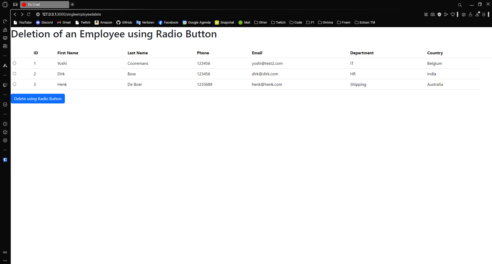
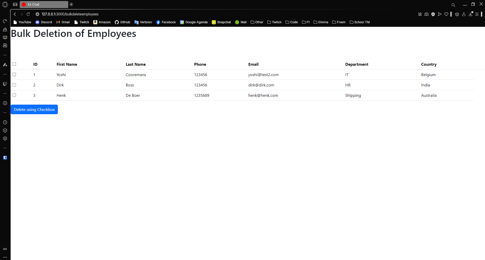
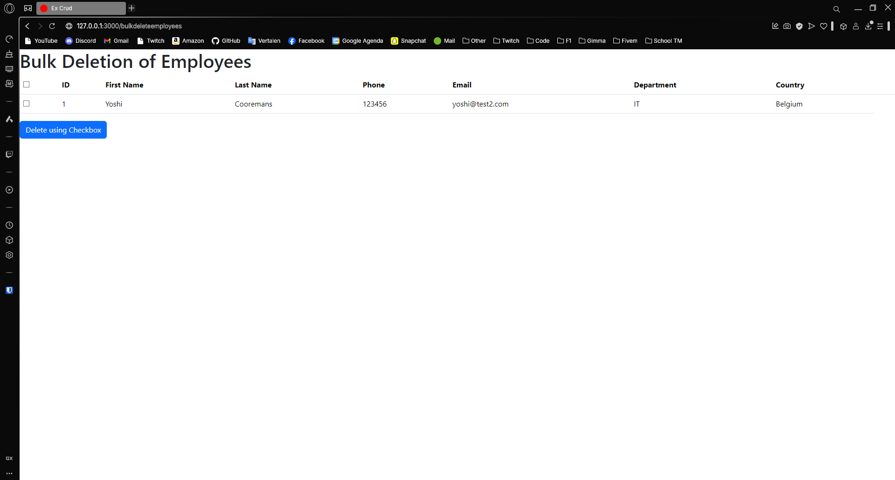
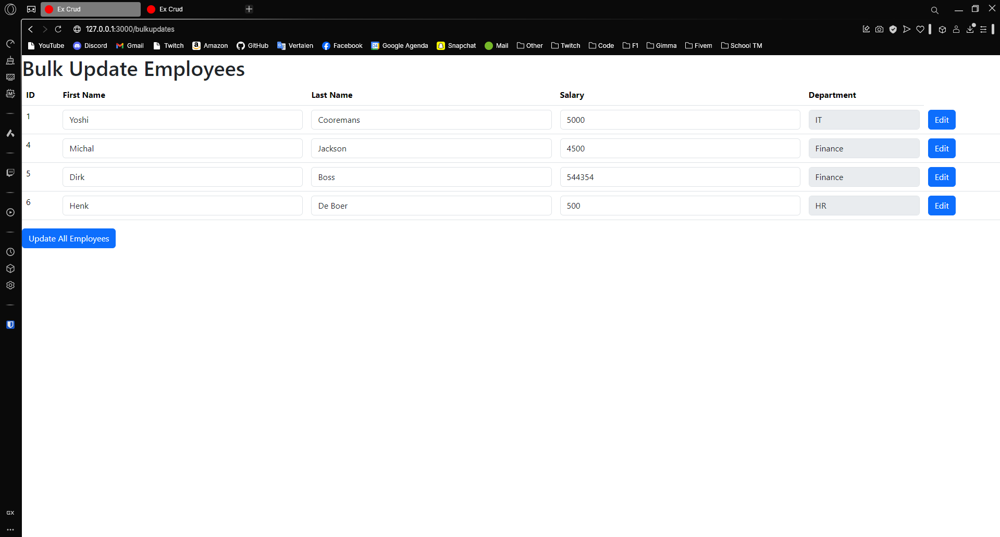
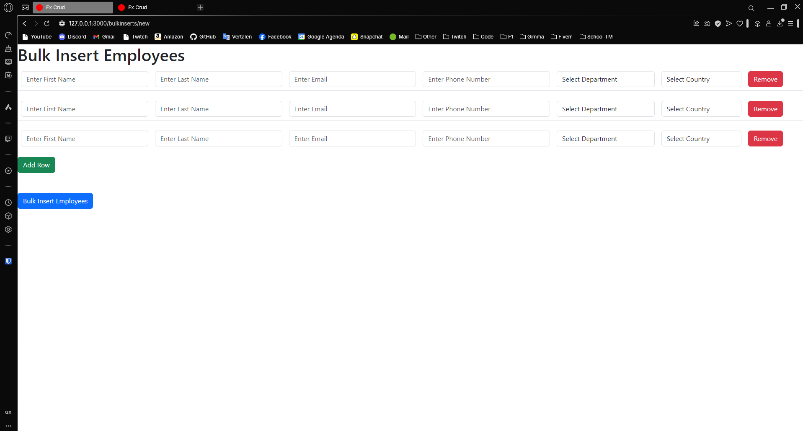
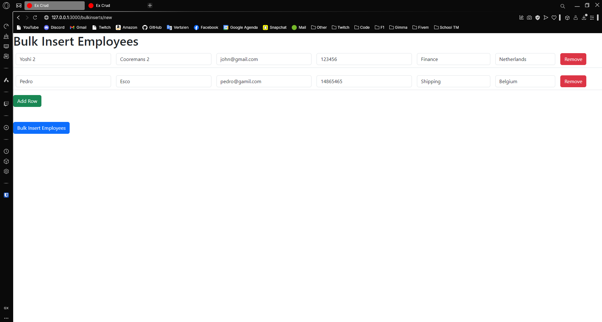
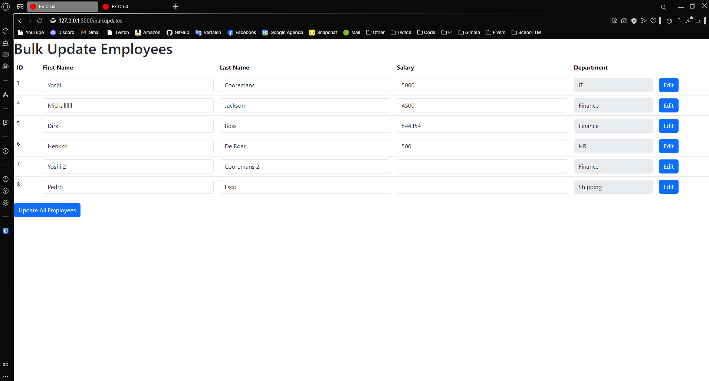

---
[⬅️ Vorige](./ReadMe-Section-14.md) • [🏠 Terug naar Hoofdpagina](../ReadMe.md) • [Volgende ➡️](./ReadMe-Section-18.md)
---

# Sectie 15 + 16 + 17

# Sectie 15 | Bulk Delete

# 1. Rij verwijderen via een radio button

Klikken van radio button voor verwijderen

# 2. Verwijderen van meerdere items via een check box

Eerste lijst

Geselecteerde items

Lijst met verwijderde

# Sectie 16 | Bulk update

## 1. Bulk update van data

Weergeven van alle data met readonly velden

Velden editen door op edit te klikken

Opslaan van wijzigingen

# Sectie 17 | Bulk insert

## 1. Bulk insert van data

Rijen toevoegen x aantal keer

Data invullen in de rijen

Data opgeslagen in bulk (weergegeven in de update)

