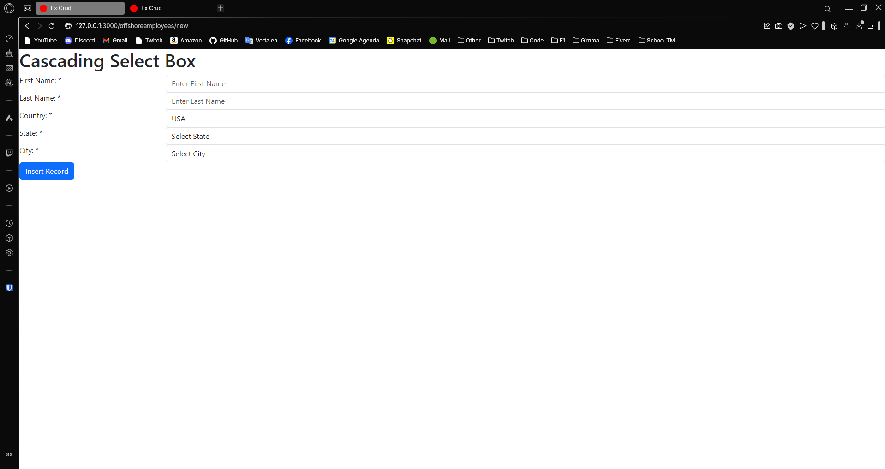
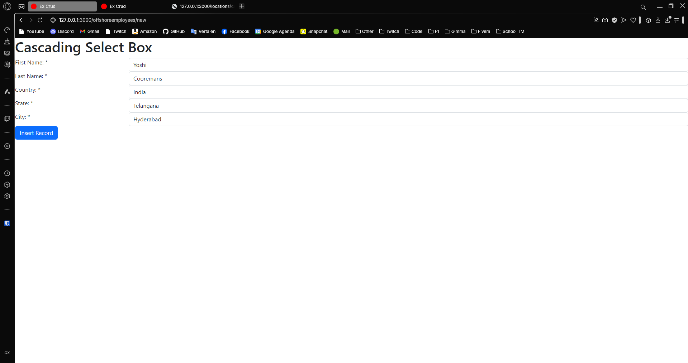
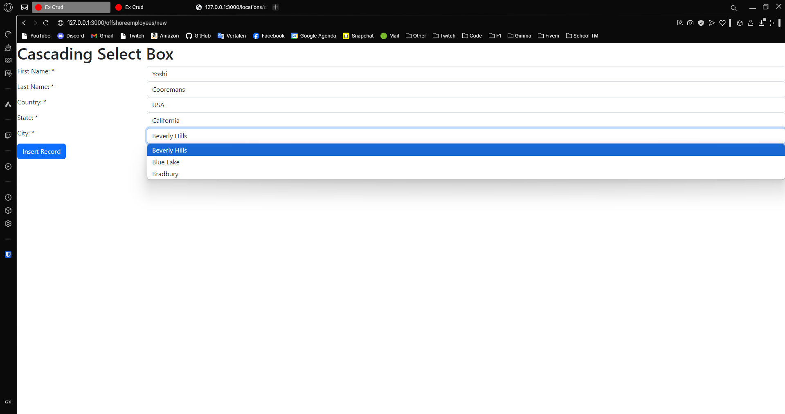

---
[⬅️ Vorige](./ReadMe-Section-15-16-17.md) • [🏠 Terug naar Hoofdpagina](../ReadMe.md) • [Volgende ➡️](./ReadMe-Section-19.md)
---

# Sectie 18 | Dropdown lists

## 1. Models en Foreign keys klaarmaken

Output van de migrations

```ps
rails db:migrate


== 20250206181954 CreateStates: migrating =====================================
-- create_table(:states)
   -> 0.0042s
== 20250206181954 CreateStates: migrated (0.0047s) ============================

== 20250206182039 CreateCities: migrating =====================================
-- create_table(:cities)
   -> 0.0071s
== 20250206182039 CreateCities: migrated (0.0076s) ============================

== 20250206182112 AddCountryToState: migrating ================================
-- add_reference(:states, :country, {:null=>false, :foreign_key=>true})
   -> 0.0856s
== 20250206182112 AddCountryToState: migrated (0.0863s) =======================

== 20250206182148 AddStateToCity: migrating ===================================
-- add_reference(:cities, :state, {:null=>false, :foreign_key=>true})
   -> 0.0538s
== 20250206182148 AddStateToCity: migrated (0.0546s) ==========================

== 20250206182250 CreateOffshoreemployees: migrating ==========================
-- create_table(:offshoreemployees)
   -> 0.0033s
== 20250206182250 CreateOffshoreemployees: migrated (0.0038s) =================

== 20250206182351 AddCountryToOffshoreemployee: migrating =====================
-- add_reference(:offshoreemployees, :country, {:null=>false, :foreign_key=>true})
   -> 0.0531s
   -> 0.0531s
== 20250206182351 AddCountryToOffshoreemployee: migrated (0.0540s) ============

== 20250206182413 AddStateToOffshoreemployee: migrating =======================
-- add_reference(:offshoreemployees, :state, {:null=>false, :foreign_key=>true})
-- add_reference(:offshoreemployees, :state, {:null=>false, :foreign_key=>true})
-- add_reference(:offshoreemployees, :state, {:null=>false, :foreign_key=>true})
   -> 0.0611s
-- add_reference(:offshoreemployees, :state, {:null=>false, :foreign_key=>true})
-- add_reference(:offshoreemployees, :state, {:null=>false, :foreign_key=>true})
   -> 0.0611s
-- add_reference(:offshoreemployees, :state, {:null=>false, :foreign_key=>true})
-- add_reference(:offshoreemployees, :state, {:null=>false, :foreign_key=>true})
-- add_reference(:offshoreemployees, :state, {:null=>false, :foreign_key=>true})
   -> 0.0611s
== 20250206182413 AddStateToOffshoreemployee: migrated (0.0619s) ==============

== 20250206182439 AddCityToOffshoreemployee: migrating ========================
-- add_reference(:offshoreemployees, :city, {:null=>false, :foreign_key=>true})
   -> 0.0638s
== 20250206182439 AddCityToOffshoreemployee: migrated (0.0645s) ===============
```

## 2. Seeding de master table

Enkele voorbeelden:

```rb
unless State.blank?
  State.create!(name: "Telangana", country_id: 1)
  State.create!(name: "Andhra Pradesh", country_id: 1)

  ...
end

unless City.blank?
  City.create!(name: "Hyderabad", state_id: 1)
  City.create!(name: "Secunderabad", state_id: 1)

  ...
end
```

## 3. Controller acties zetten

Aanmaken van de methods in de controller

```rb
def new
    @offshoreemployee = Offshoreemployee.new
  end

  def create
    @offshoreemployee = Offshoreemployee.new(offshoreemployee_params)
    if @offshoreemployee.save
      redirect_to new_opffshoreemployee_path
    else
      render :new, status: :unprocessable_entity
    end
  end

  private
  def offshoreemployee_params
    params.require(:offshoreemployee).permit(:firstname, :lastname, :country_id, :state_id, :city_id)
  end

```

## 4. Aanmaken van de views

Screen van de view



## 5. Rails.ajax gebruiken om de juiste states en city gebaseerd op de Country op te halen.

Inladen van de juiste data



Andere data


