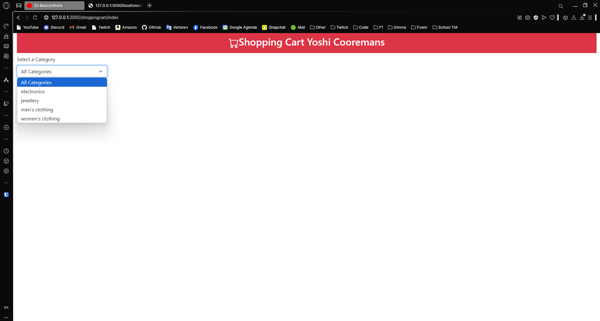
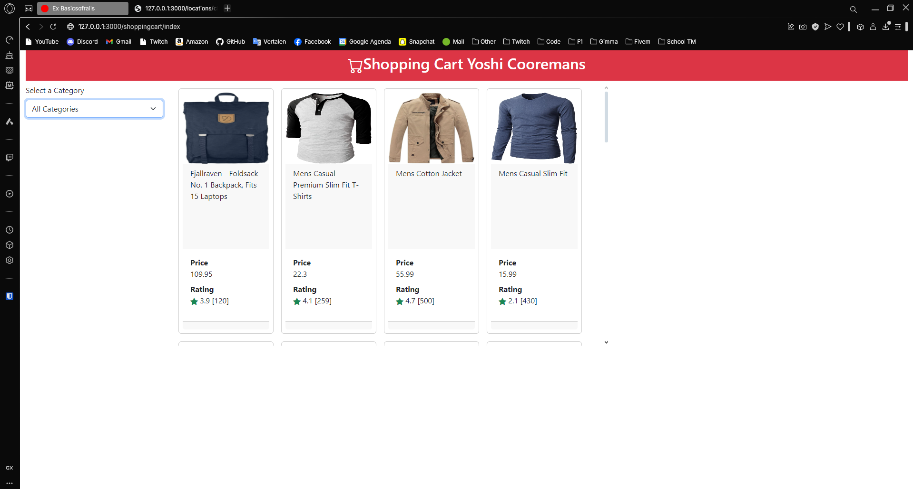
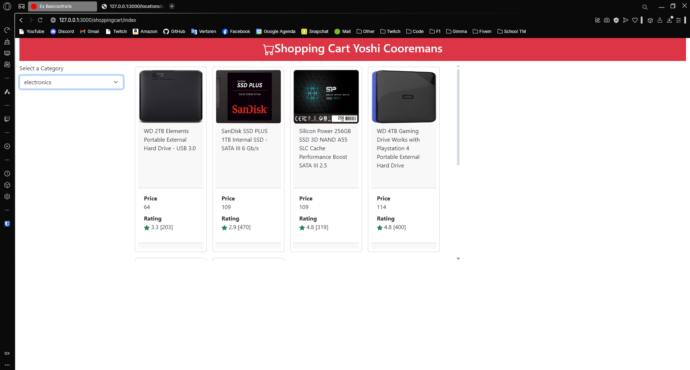
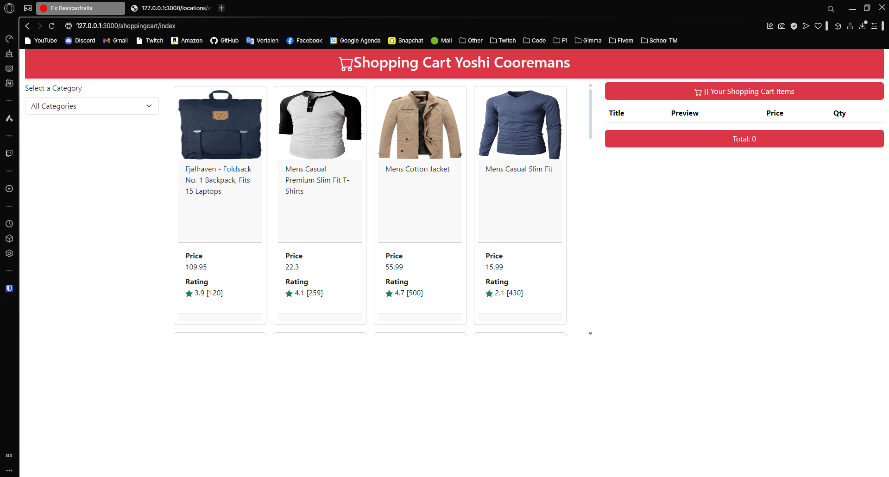
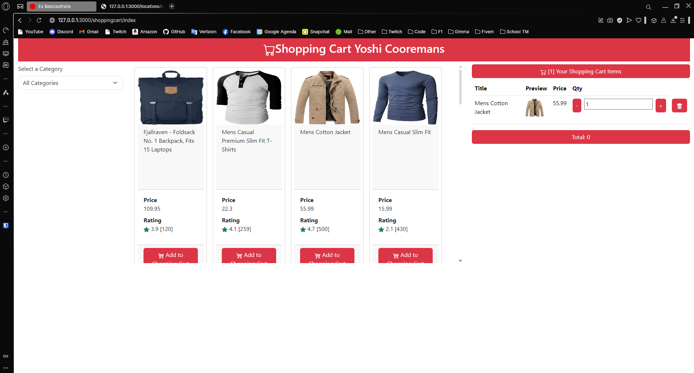

---
[⬅️ Vorige](./ReadMe-Section-18.md) • [🏠 Terug naar Hoofdpagina](../ReadMe.md) • [Volgende ➡️](./ReadMe-Section-20.md)
---

# Sectie 19 | Shoppingcart

## 1. Basis layout van de shoppingcart

De categories worden opgehaald uit een API.

## 2. Layout van de producten met filter op categorie

Alle producten:

Electronics:

## 3. Shopping cart layout

## 4. Add to cart functionaliteit

## 5. Aantal van het product toevoegen of verwijderen

Door op + en - te klikken

## 6. Verwijderen van shoppingcart

Je kunt ook de items weer uit je shoppingcart halen.
