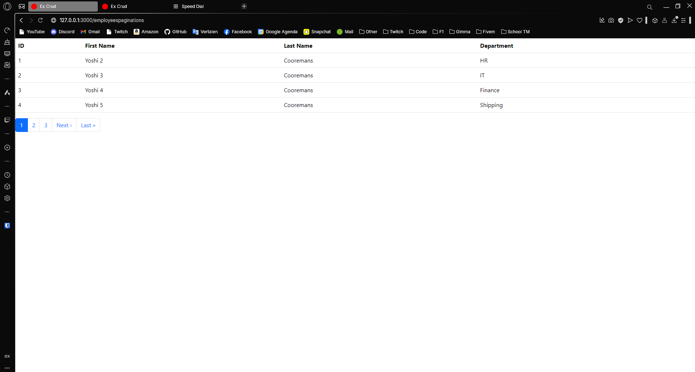
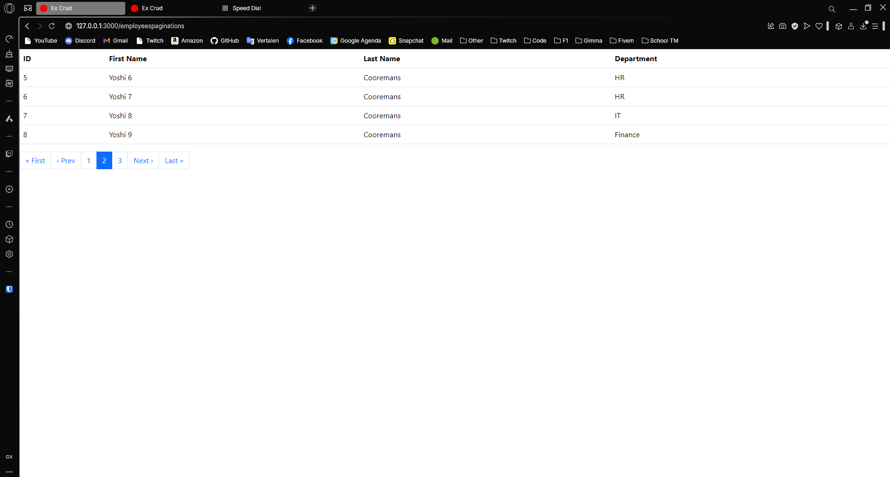
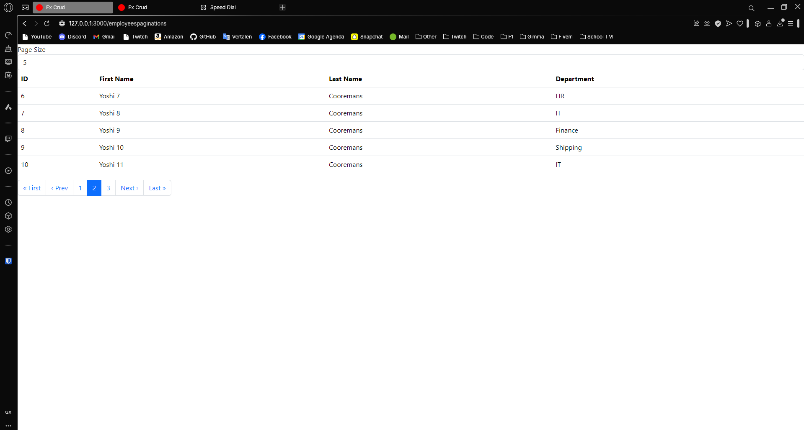
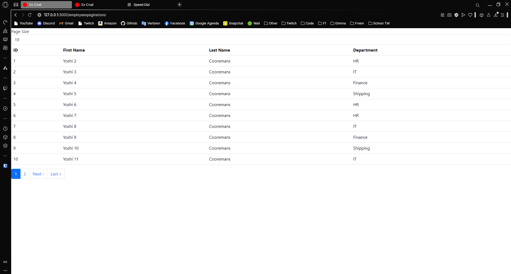
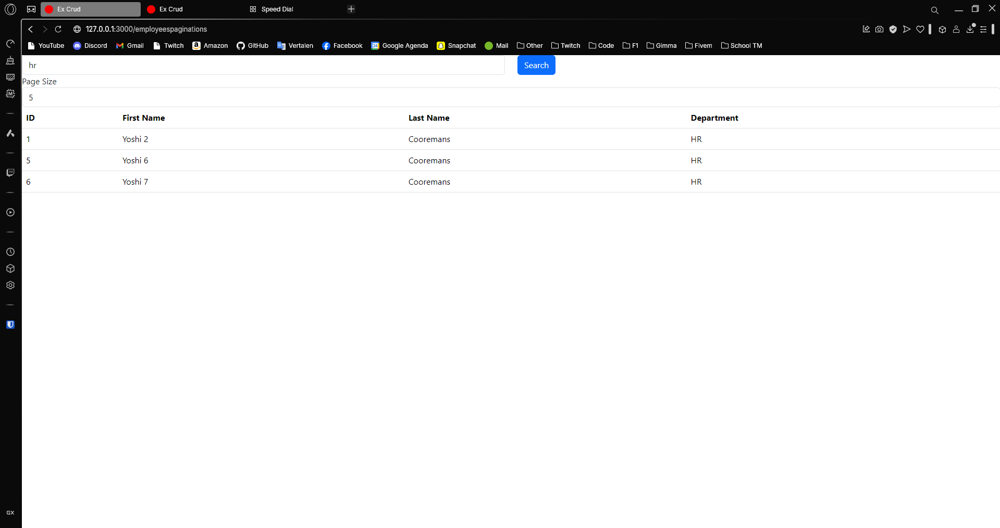
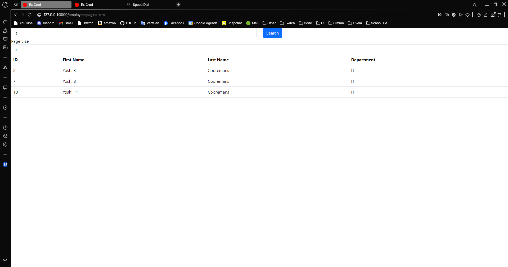

---
[⬅️ Vorige](./ReadMe-Section-19.md) • [🏠 Terug naar Hoofdpagina](../ReadMe.md) • [Volgende ➡️](./ReadMe-Section-21-22-23.md)
---

# Sectie 20 | Pagination

## 1. Instellen van Kaminari Paginator

```rb
gem "kaminari"
```

Command:

```ps
rails g kaminari:config

rails g kaminari:views bootstrap4
```

## 2. Implementeren van de Pagination

Paginering





## 3. Pagina grotes meegeven

Per 5:



Per 10:



## 4. Search functionalitei

Zoeken op hr:



Zoeken op it:


