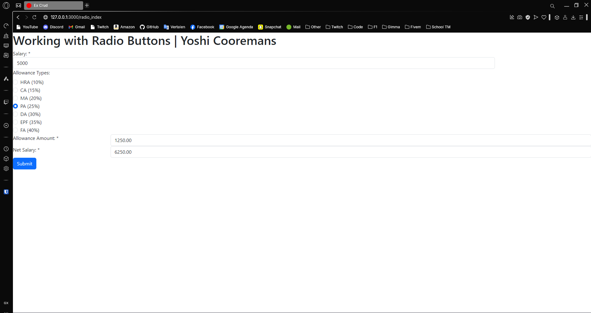
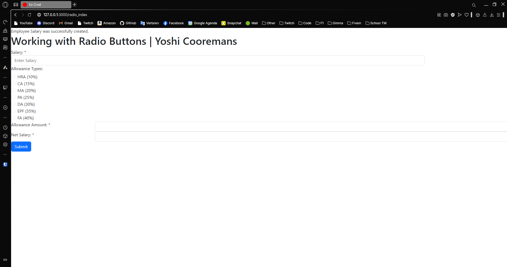
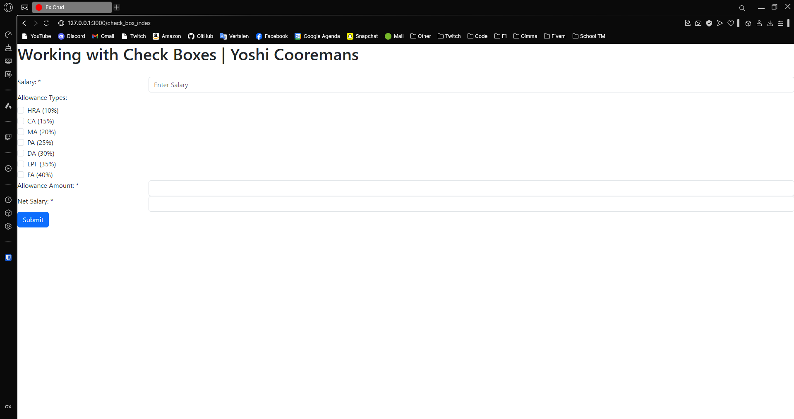
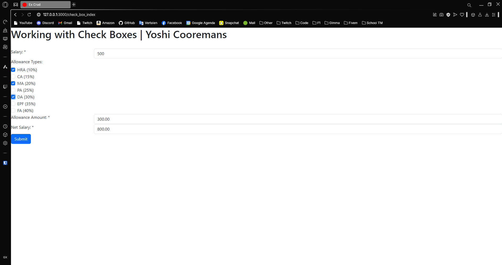
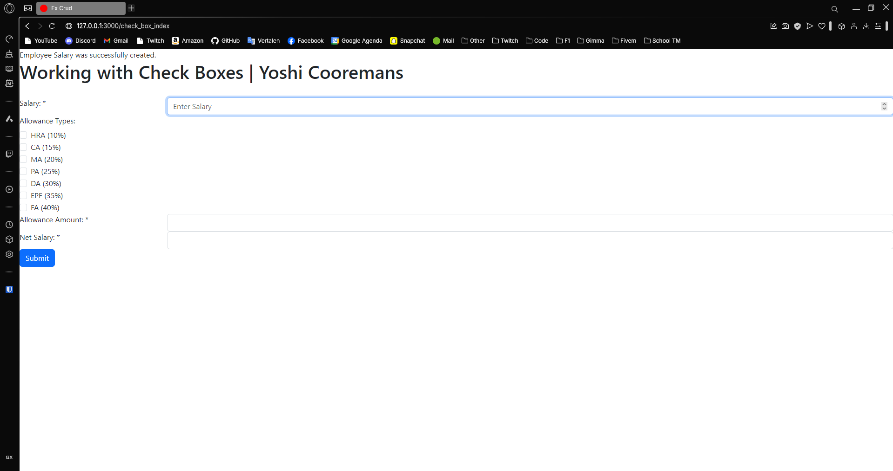
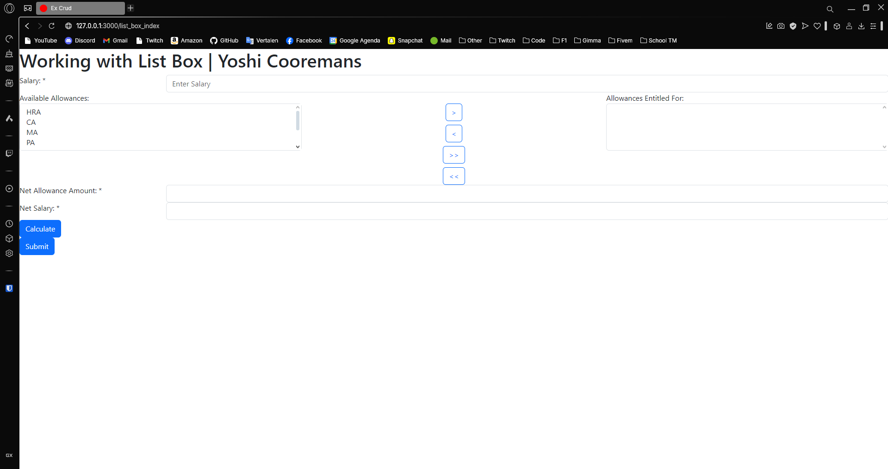
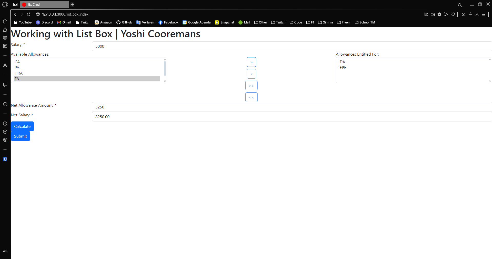
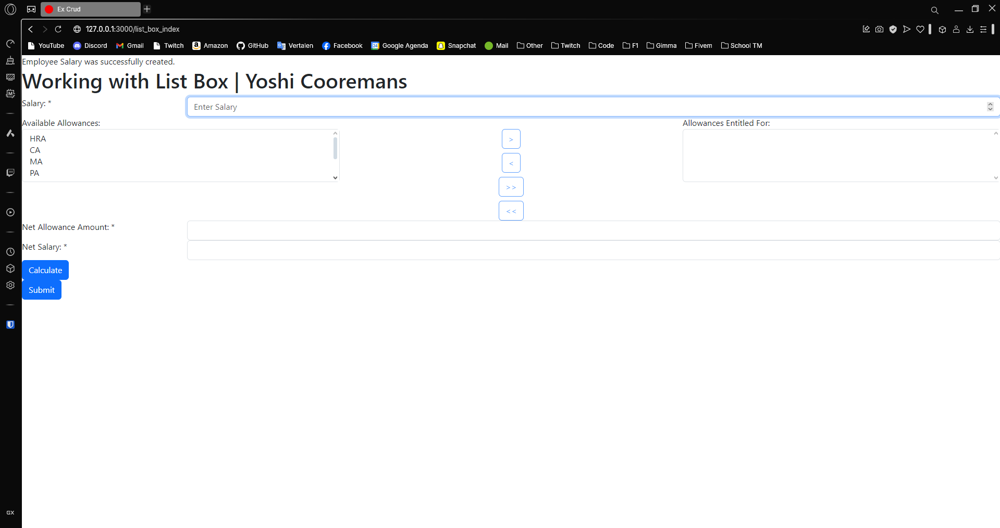

---
[⬅️ Vorige](./ReadMe-Section-20.md) • [🏠 Terug naar Hoofdpagina](../ReadMe.md) • [Volgende ➡️](./ReadMe-Section-24.md)
---

# Section 21

# 1. Aanmaken van de tables en relaties:

```ps
rails generate model allowancetype name:string percentage:integer

rails generate model employeesalary salary:integer netallowanceamount:integer netsalary:integer

rails generate model employeeallowance

rails generate migration add_allowancetype_to_employeeallowance allowancetype:references

rails generate migration add_employeesalary_to_employeeallowance employeesalary:references

rails db:migrate
```

# 2. Seed data

```rb
unless Allowancetype.blank?
  Allowancetype.create!(name: "HRA", percentage: 10)
  Allowancetype.create!(name: "CA", percentage: 15)
  Allowancetype.create!(name: "MA", percentage: 20)
  Allowancetype.create!(name: "PA", percentage: 25)
  Allowancetype.create!(name: "DA", percentage: 30)
  Allowancetype.create!(name: "EPF", percentage: 35)
  Allowancetype.create!(name: "FA", percentage: 40)
end
```

# 3. Controller en view

Layout voor de radio buttons:


Salary berekent bij selecteren radio button



De data wordt ook opgeslagen in de db.



# Sectie 22

## 1. Layout voor de checkboxes



## 2. Berekening voor de waardes met checkboxes percentage



## 3. Data opgeslagen in de database



# Sectie 23

## 1. Layout voor de views voor ListBoxes



## 2. Items links of rechts plaatsen met berekening



## 3. Data opgeslagen in de database


