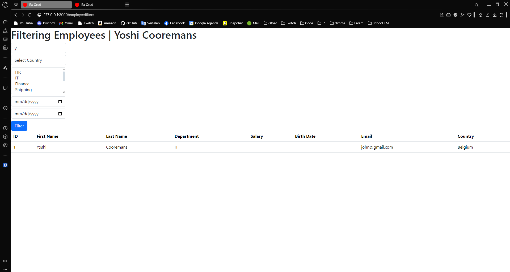
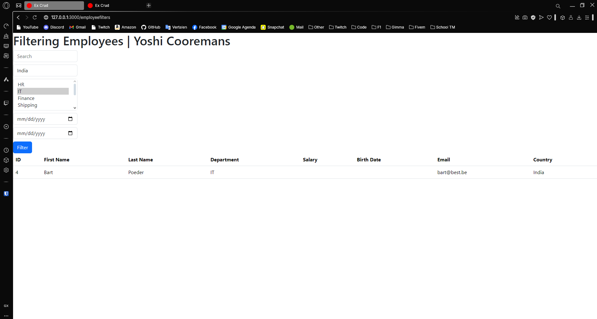
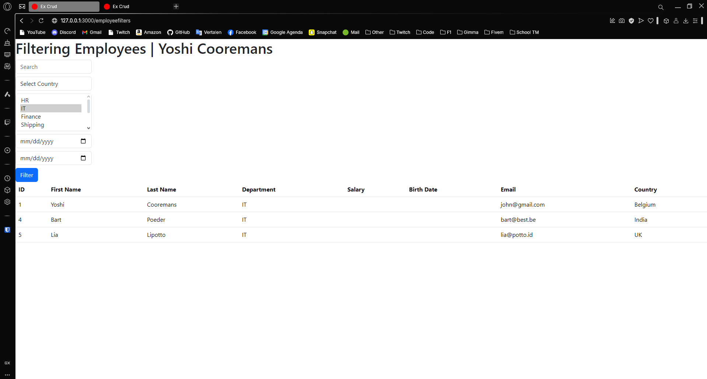

---
[⬅️ Vorige](./ReadMe-Section-21-22-23.md) • [🏠 Terug naar Hoofdpagina](../ReadMe.md) • [Volgende ➡️](./ReadMe-Section-25.md)
---

# Sectie 24

## 1. Filtering met where clause

Controller aanmaken:

```ps
rails g controller employeefilters
```

Zoeken op firstname

```ruby
@employees = @employees.where("firstname LIKE ?", "#{params[:search]}%")
```

Zoeken op firstname en/of lastname

```ruby
@employees = @employees.where("firstname LIKE ? AND lastname LIKE ?",
    "%#{params[:search]}%",  "%#{params[:search]}%")

@employees = @employees.where("firstname LIKE ? OR lastname LIKE ?",
    "%#{params[:search]}%",  "%#{params[:search]}%")
```

Zoeken op email of niet.

```ruby
@employees = @employees.where(email: params[:search])

@employees = @employees.where.not(email: params[:search])

```

Zoeken op Country of niet.

```ruby
@employees = @employees.where(country_id: params[:country_id]) if params[:country_id].present?

@employees = @employees.where.not(country_id: params[:country_id]) if params[:country_id].present?
```

Enkele Voorbeelden:







## 2. Filtering met find, take, order, ...

```ruby
# Zoeken op ID
@employee = Employee.find(16)

@employee = Employee.find([16,17]) #Array of Primary Keys

# Pakt de eerste 3 records
@employee = Employee.take(3)

@employee = Employee.first

@employee = Employee.first(3)

# Pakt de eerste naam gesorteerd
@employee = Employee.order(:firstname).first

@employee = Employee.last
@employee = Employee.last(3)
@employee = Employee.order(:firstname).last

# Zoeken op naam
@employee = Employee.find_by(firstname: "Connors")
@employee = Employee.where(firstname: "Connors").take

@employee=Employee.select(:firstname, :lastname)
@employee.select(:last_name).distinct

# Maximum 5 records
@employee = Employee.limit(5)
@employee = Employee.limit(5).offset(5)

Employee.group(:department_id).count

Employee.where("id > 10").order(:salary).reverse_order

# Include relaties
Employee.joins("INNER JOIN departments ON Employees.department_id = departments.id")

Employee.joins(:department)
Employee.joins(:department, :country)

# Kijkt of record bestaat
Employee.exists?(1)
Employee.exists?(id: [1,2,3])
Employee.where(firstname: 'Connors').exists?
Employee.exists?

# Telt het aantal records
Employee.count
Employee.where(firstname: 'Connors').count
```
