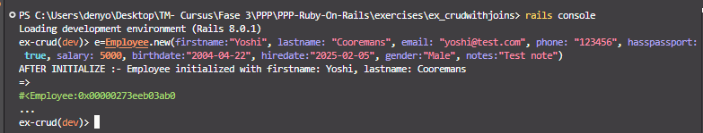
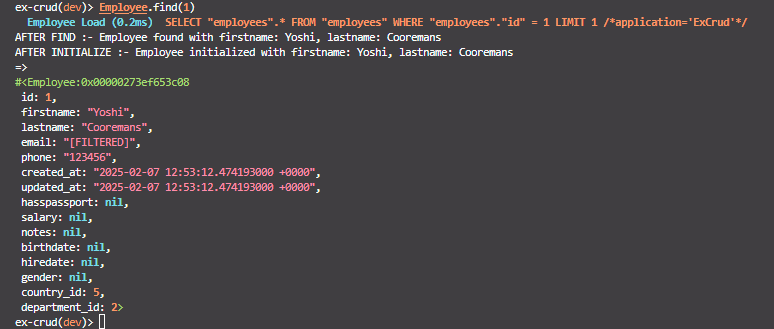
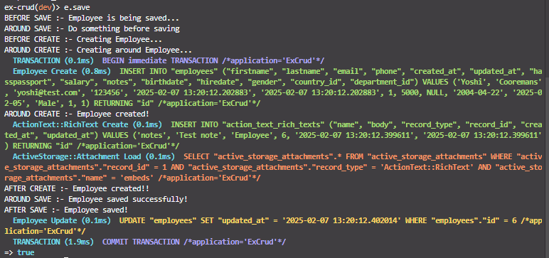
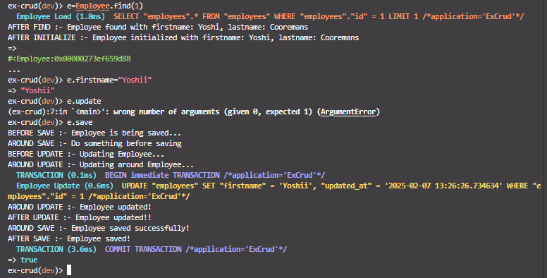

---
[⬅️ Vorige](./ReadMe-Section-24.md) • [🏠 Terug naar Hoofdpagina](../ReadMe.md) • [Volgende ➡️](./ReadMe-Section-26.md)
---

# Sectie 25

## 1. Callbacks na aanmaken model

```rb
after_initialize :do_after_initialize

def do_after_initialize
    puts "AFTER INITIALIZE :- Employee initialized with firstname: #{firstname}, lastname: #{lastname}"
end
```



## 2. Callbacks na het zoeken

```rb
after_find :output_after_find

def output_after_find
    puts "AFTER FIND :- Employee found with firstname: #{firstname}, lastname: #{lastname}"
end
```



## 3. Callback voor en na het saven

```rb
before_save :print_save_message
around_save :print_around_save_message
after_save :print_saved_message

def print_save_message
    puts "BEFORE SAVE :- Employee is being saved..."
    today = Date.today
    if today.saturday? || today.sunday?
      errors.add(:base, "Cannot insert record on a Saturday or Sunday")
      throw(:abort)
    end
end

def print_around_save_message
puts "AROUND SAVE :- Do something before saving"
yield
puts "AROUND SAVE :- Employee saved successfully!"
end

def print_saved_message
puts "AFTER SAVE :- Employee saved!"
end
```

## 4. Callback voor en na het creeren

```rb
before_create :print_create_message
around_create :print_around_create_message
after_create :print_created_message

def print_create_message
    puts "BEFORE CREATE :- Creating Employee..."
end

def print_around_create_message
    puts "AROUND CREATE :- Creating around Employee..."
    yield
    puts "AROUND CREATE :- Employee created!"
end

def print_created_message
    puts "AFTER CREATE :- Employee created!!"
end
```

## 5. Callback voor en na het updaten

```rb
before_update :print_update_message
around_update :print_around_update_message
after_update :print_updated_message

def print_update_message
    puts "BEFORE UPDATE :- Updating Employee..."
end

def print_around_update_message
    puts "AROUND UPDATE :- Updating around Employee..."
    yield
    puts "AROUND UPDATE :- Employee updated!"
end

def print_updated_message
    puts "AFTER UPDATE :- Employee updated!!"
end
```

## 6. Callback voor en na verwijderen

```rb
before_destroy :print_destroy_message
around_destroy :print_around_destroy_message
after_destroy :print_destroyed_message

def print_destroy_message
    puts "BEFORE DESTROY :- Destroying Employee..."
end

def print_around_destroy_message
    puts "AROUND DESTROY :- Destroying around Employee..."
    yield
    puts "AROUND DESTROY :- Employee destroyed!"
end

def print_destroyed_message
    puts "AFTER DESTROY :- Employee destroyed!!"
    Backupemployee.create(firstname: self.firstname, lastname: self.lastname)
end
```

## 7. Voorbeelden:




