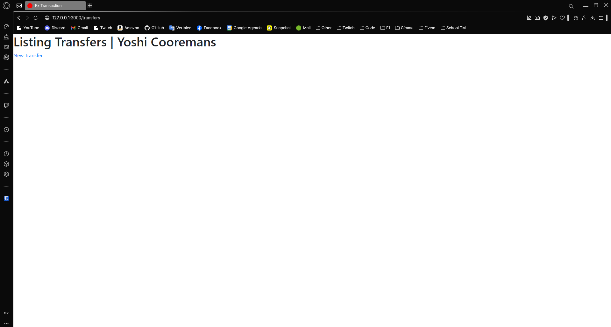
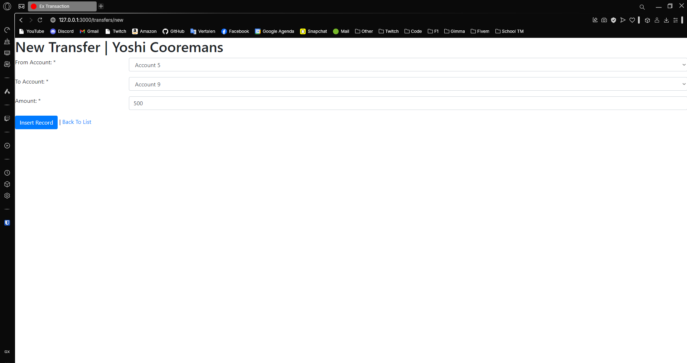
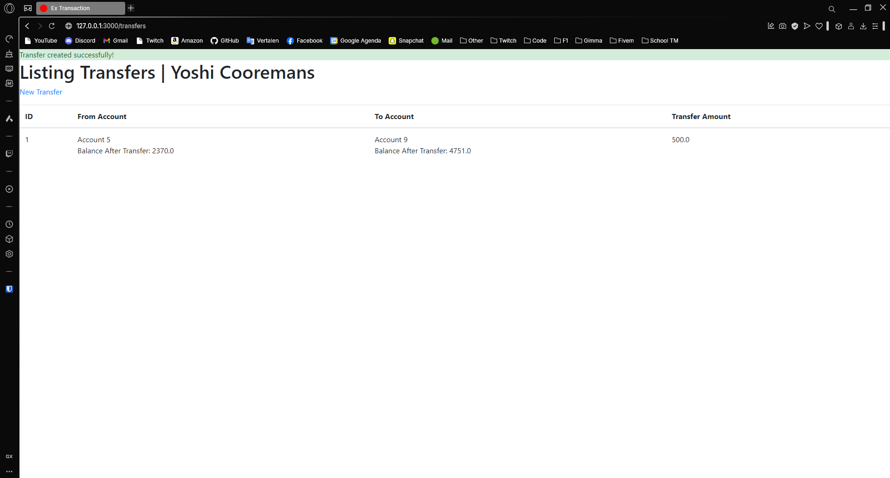

---
[⬅️ Vorige](./ReadMe-Section-25.md) • [🏠 Terug naar Hoofdpagina](../ReadMe.md) • [Volgende ➡️](./ReadMe-Section-27.md)
---

# Sectie 26 | Transaction

## 1. Aanmaken models + seeder

```ps
rails g model account name:string balance:decimal

rails g model transfer amount:decimal
```

Seeder:

```rb
unless Account.blank?
  (1..15).each do |i|
    Account.create!(
      name: "Account #{i}",
      balance: rand(1000..10000)
    )
  end
end
```

## 2. Controllers aanmaken met index action

Aanmaken controller:

```ps
rails g controller transfers
```

View voor de lijst:



View voor het toevoegen:


## 3. Wegschrijven van de data

```rb
def create
    @transfer = Transfer.new(transfer_params)

    # Transaction, als 1 update of save mislukt gaat niks door.
    Transfer.transaction do
      if @transfer.save!

        @transfer.deduct_from_account
        @transfer.deduct_from_account_balance
        @transfer.add_to_account

        redirect_to transfers_path, notice: "Transfer created successfully!"
      else
        flash[:alert] = "Failed to create transfer: #{@transfer.errors.full_messages}"
        render :new
      end
    end
  rescue ActiveRecord::RecordInvalid => e
    render :new
    flash[:alert] = "Failed to create transfer: #{e.message}"
  end

```

Invullen data:



Opgeslagen data in de lijst (succesvol):


