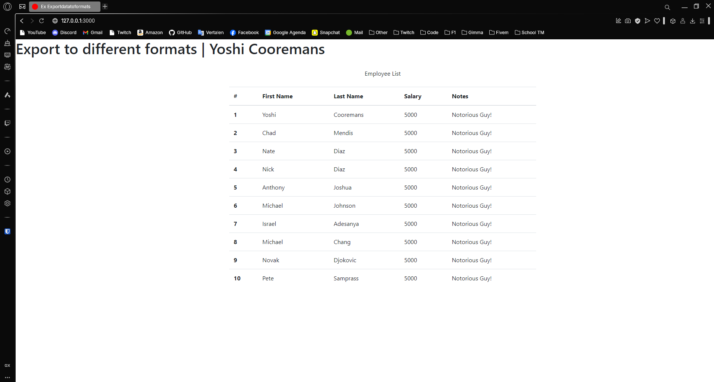
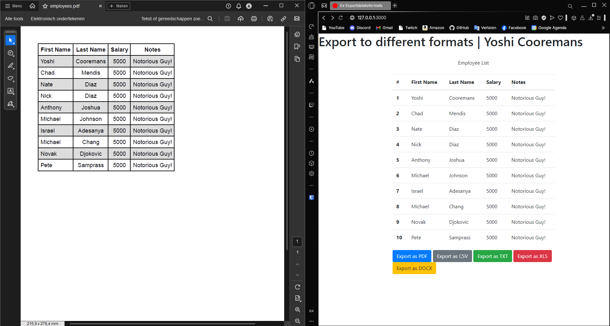
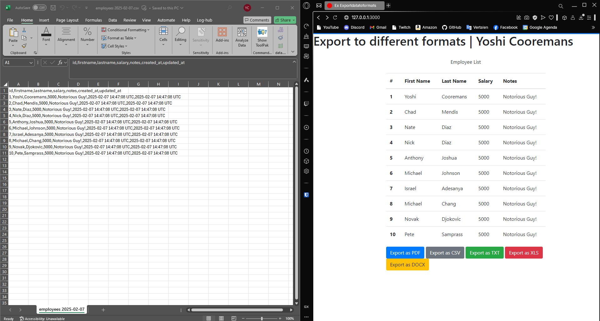
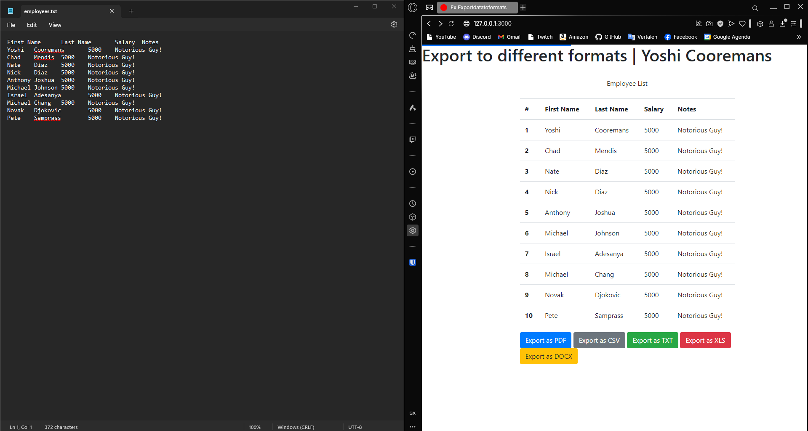
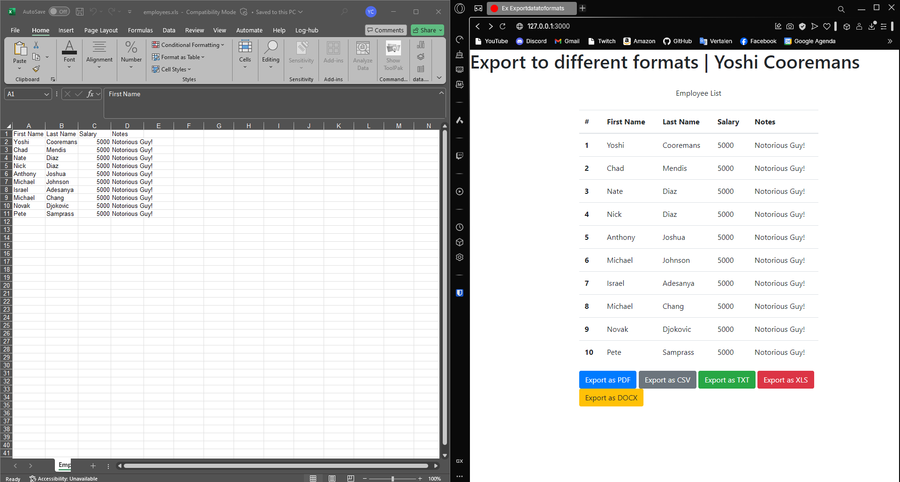
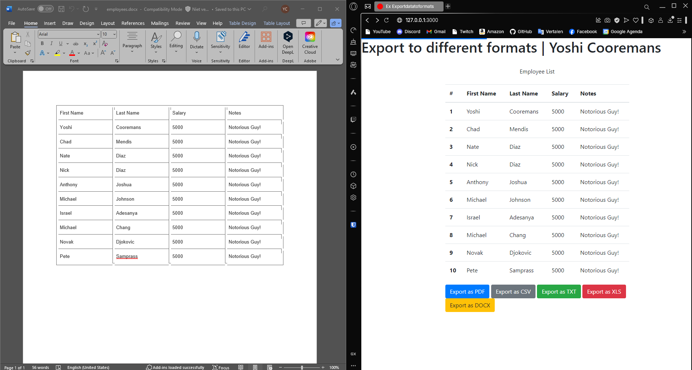

---
[⬅️ Vorige](./ReadMe-Section-26.md) • [🏠 Terug naar Hoofdpagina](../ReadMe.md) • [Volgende ➡️](./ReadMe-Section-28.md)
---

# Sectie 27 | Export Data naar verschillende formats

## 1. Installing required GEMS

```rb
gem "tiny_tds"
gem "activerecord-sqlserver-adapter"

# Voor PDF te maken
gem "prawn"
gem "prawn-table"

# Voor CSV te maken
gem "csv"

# Voor XLS te maken
gem "spreadsheet"

# Voor Docx te maken
gem "caracal"
```

## 2. Models en seeder

```ps
rails g model belfastemployee firstname:string lastname:string salary:integer notes:string
```

Seeder:

```rb
unless Belfastemployee.blank?
  Belfastemployee.create!(firstname: "Yoshi", lastname: "Cooremans", salary: 5000, notes: 'Notorious Guy!')

  Belfastemployee.create!(firstname: "Chad", lastname: "Mendis", salary: 5000, notes: 'Notorious Guy!')

  Belfastemployee.create!(firstname: "Nate", lastname: "Diaz", salary: 5000, notes: 'Notorious Guy!')

  Belfastemployee.create!(firstname: "Nick", lastname: "Diaz", salary: 5000, notes: 'Notorious Guy!')

  Belfastemployee.create!(firstname: "Anthony", lastname: "Joshua", salary: 5000, notes: 'Notorious Guy!')

  Belfastemployee.create!(firstname: "Michael", lastname: "Johnson", salary: 5000, notes: 'Notorious Guy!')

  Belfastemployee.create!(firstname: "Israel", lastname: "Adesanya", salary: 5000, notes: 'Notorious Guy!')

  Belfastemployee.create!(firstname: "Michael", lastname: "Chang", salary: 5000, notes: 'Notorious Guy!')

  Belfastemployee.create!(firstname: "Novak", lastname: "Djokovic", salary: 5000, notes: 'Notorious Guy!')

  Belfastemployee.create!(firstname: "Pete", lastname: "Samprass", salary: 5000, notes: 'Notorious Guy!')
end
```

## 3. Controller en views

Default index method uit de controller showt een standaard tebel



Route met parameter om te kiezen tussen welke type je wilt exporteren

```rb
def export_as
    @employees = Belfastemployee.all
    if params[:export_type] == "pdf"
      export_as_pdf
    elsif params[:export_type] == "csv"
      export_as_csv
    elsif params[:export_type] == "txt"
      export_as_txt
    elsif params[:export_type] == "xls"
      export_as_xls
    elsif params[:export_type] == "docx"
      export_as_docx
    else
      redirect_to root_path
    end
end
```

[](https://wakatime.com/badge/user/c32be302-ab13-47a5-ad5b-c441652a6738/project/64dc25d2-640f-4a56-9877-55431f401c45)

## 4. Exporteren als PDF



## 5. Exporteren als CSV



## 6. Exporteren als TXT



## 7. Exporteren als XLS



## 8. Exporteren als DOCX


