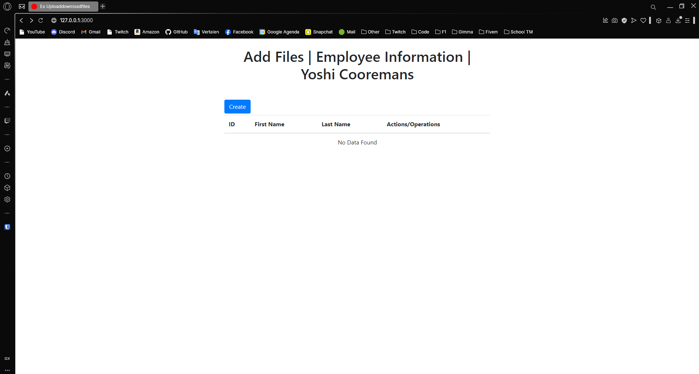
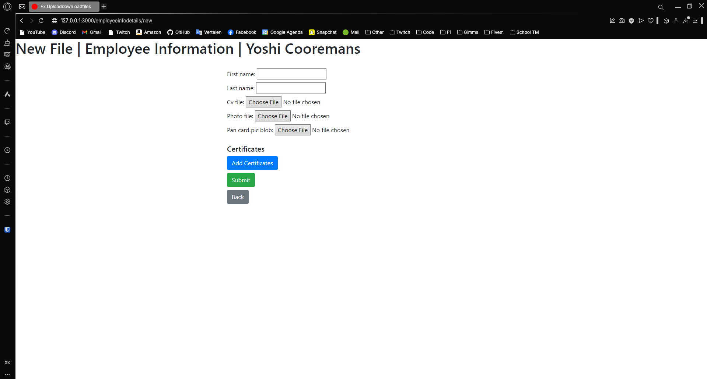
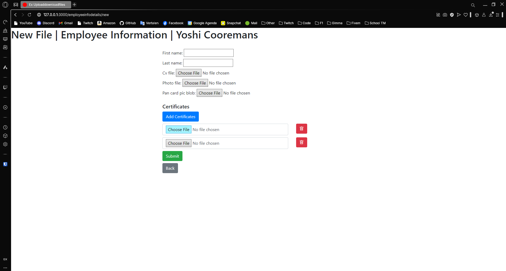
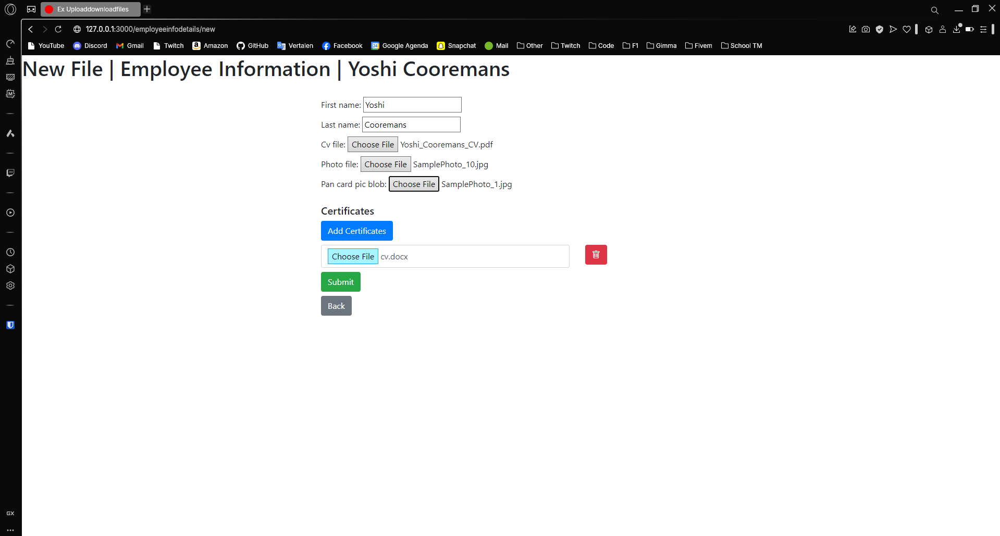
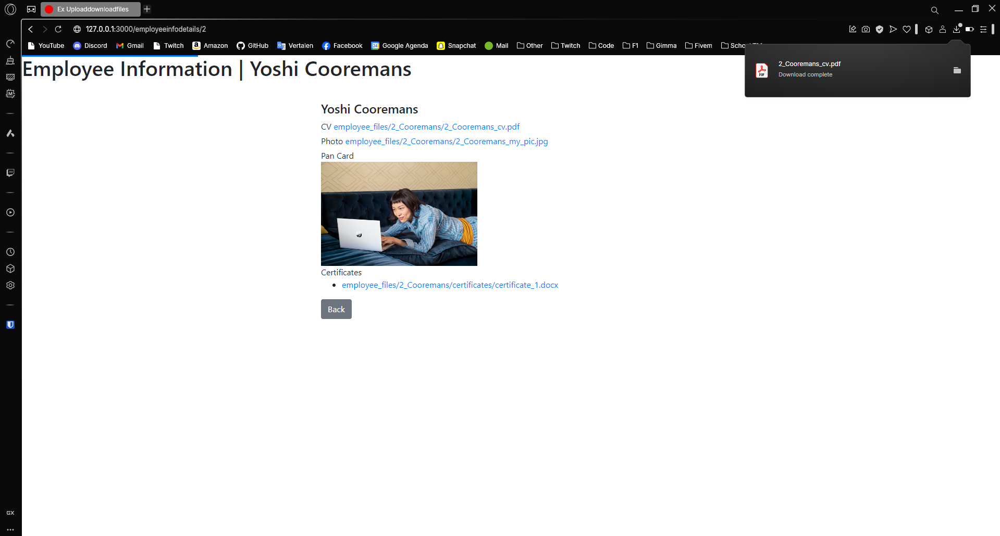

---
[⬅️ Vorige](./ReadMe-Section-27.md) • [🏠 Terug naar Hoofdpagina](../ReadMe.md) • [Volgende ➡️](./ReadMe-Section-29.md)
---

# Sectie 28 | Uploading Files

## 1. Models en gems installeren

```ps
rails generate model employeeinfo firstname:string lastname:string

rails generate model employeecertificate employeeinfo:references

rails active_storage:install
```

## 2. Aanmaken views

Overzicht:



Nieuw zonder certificaten:



Nieuw met certificaten



## 3. Nieuwe employee met certificaten aanmeken

Ingevulde data:



Lijst met nieuwe waarde


## 4. Certificaten terug downloaden en bekijken


