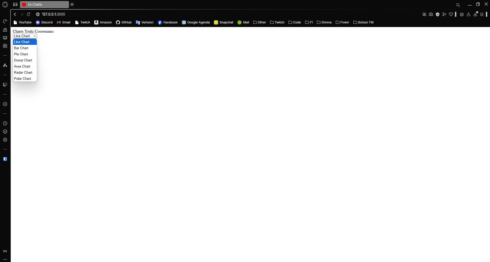
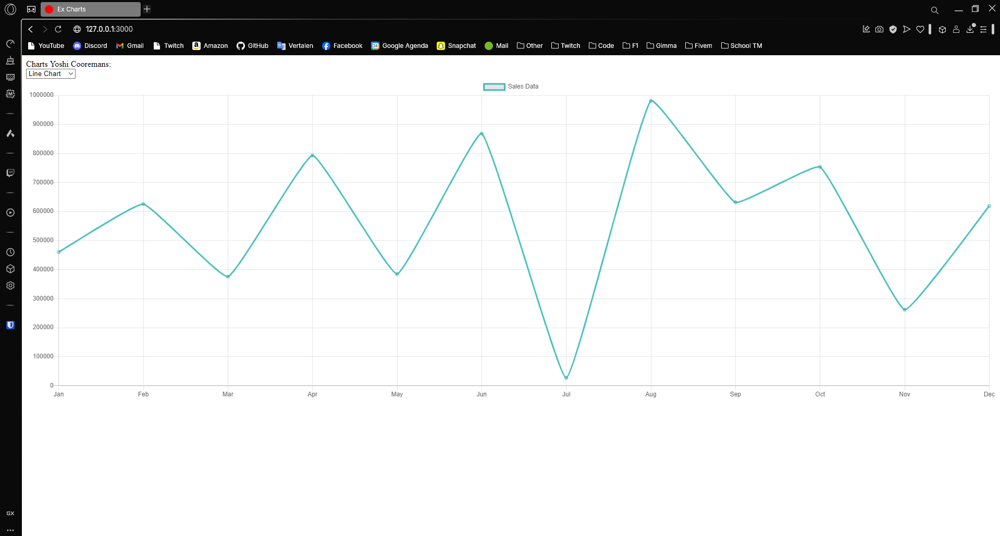
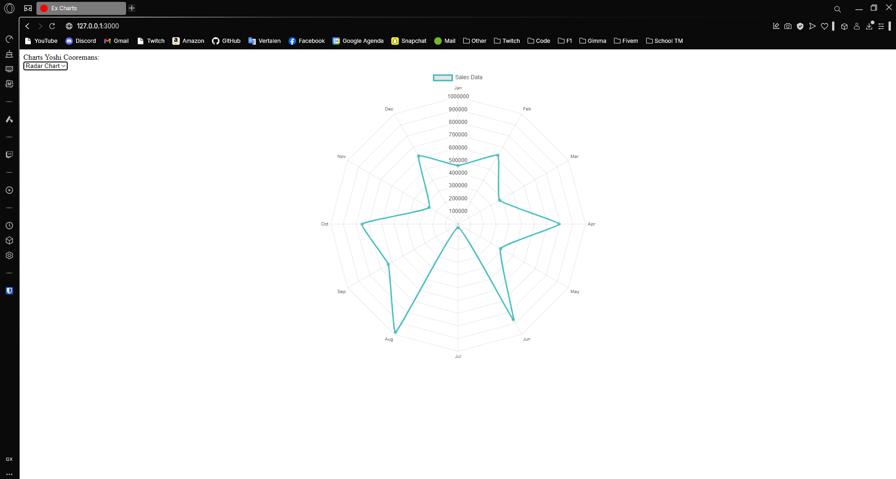
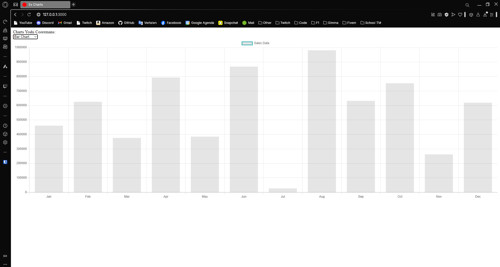

---
[⬅️ Vorige](./ReadMe-Section-28.md) • [🏠 Terug naar Hoofdpagina](../ReadMe.md) • [Volgende ➡️](./ReadMe-Section-30-31.md)
---

# Sectie 29 | Charts

## 1. Models aanmaken

```ps
rails generate model sale monthname:string amount:integer

rails db:migrate

rails generate controller charts
```

Seeder:

```rb
['Jan', 'Feb', 'Mar', 'Apr', 'May', 'Jun', 'Jul', 'Aug', 'Sep', 'Oct', 'Nov', 'Dec'].each do |mon|
	Sale.create(monthname: mon, amount: rand(11111..999999))
end
```

## 2. Controller

Index method:

```rb
def index
    @sales = Sale.all
    @chart_types = {
        'Line Chart': "line",
        'Bar Chart': "bar",
        'Pie Chart': "pie",
        'Donut Chart': "doughnut",
        'Area Chart': "area",
        'Radar Chart': "radar",
        'Polar Chart': "polarArea"
    }
end
```

Layout met dropdown:



## 3. Chart weergeven






