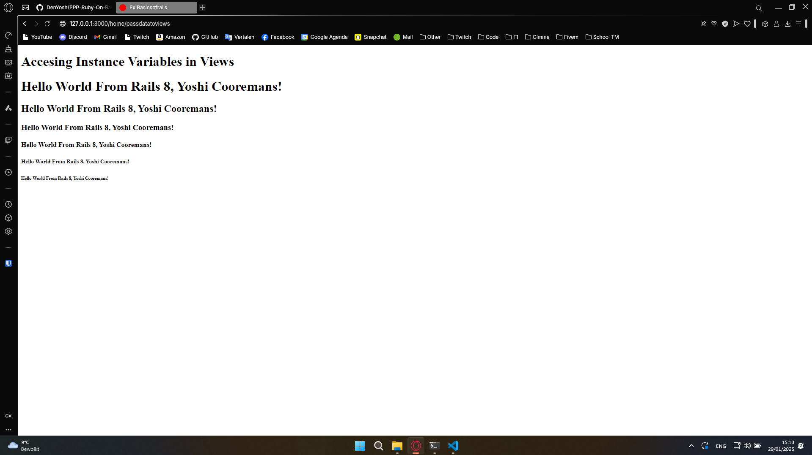

---
[⬅️ Vorige](./ReadMe-Section-1-2.md) • [🏠 Terug naar Hoofdpagina](../ReadMe.md) • [Volgende ➡️](./ReadMe-Section-4-5-6.md)
---

# Sectie 3 | Default Rails

## 1. Van de Controller naar de View met Plain Tekst

In Ruby on Rails kun je eenvoudig data (plain tekst) van de controller naar de view sturen.

## 2. Controller met Queryparams op de View Zetten

Je kunt queryparameters gebruiken om dynamische inhoud in je views weer te geven.

## 3. Data van de Controller naar de View

Het doorgeven van data van de controller naar de view:

## 4. Datum en Tijd Weergeven op de View

Het doorgeven van data gebeurt hetzelfde als punt 3.

