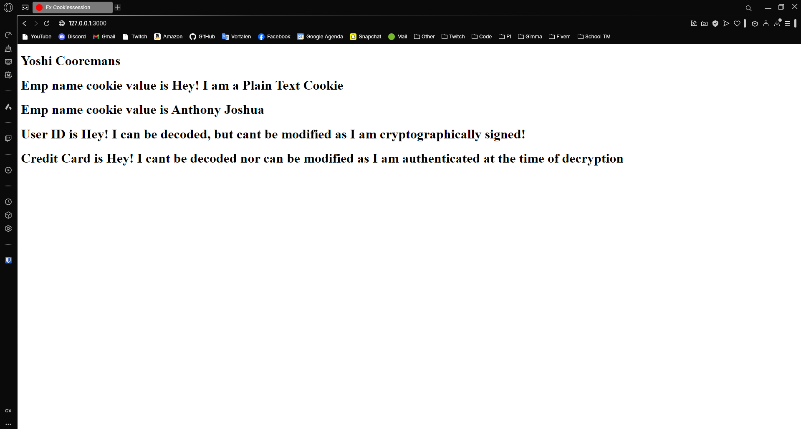

---
[⬅️ Vorige](./ReadMe-Section-29.md) • [🏠 Terug naar Hoofdpagina](../ReadMe.md) • [Volgende ➡️](./ReadMe-Section-32.md)
---

# Sectie 30 + 31

In de cursus is de volgorde van 30 en 31 omgewisseld.

# Sectie 30 | Sessions

## 1. Controller

```rb
def sessiondemo
    session[:emp_id] = 123
    session[:salary] = 16775
    session[:is_active] = true
    session[:emp_name] = "Chad Mendis"
end
```

Sessions in de view



## 2. Session data in de database opslaan

Toevoegen aan de Gemfile

```ps
gem "activerecord-session_store"
```

Initialize de session store

```rb
Rails.application.config.session_store :active_record_store, key: '_your_app_session', expire_after: 2.hours
```

Migration maken voor de database

```ps
rails generate active_record:session_migration
```

# Sectie 31 | Cookies

## 1. Controller

Verschillende soorten cookies:

```rb
def index
    # Plain Text, Signed, Encrypted

    cookies[:emp_name] = "Hey! I am a Plain Text Cookie"

    cookies[:exp_cookies] = { value: "Anthony Joshua", expires: Time.now + 2.minutes }

    cookies.signed[:user_id] = "Hey! I can be decoded, but cant be modified as I am cryptographically signed!"

    cookies.encrypted[:credit_card] = "Hey! I cant be decoded nor can be modified as I am authenticated at the time of decryption"
end
```

Cookies in de view:


