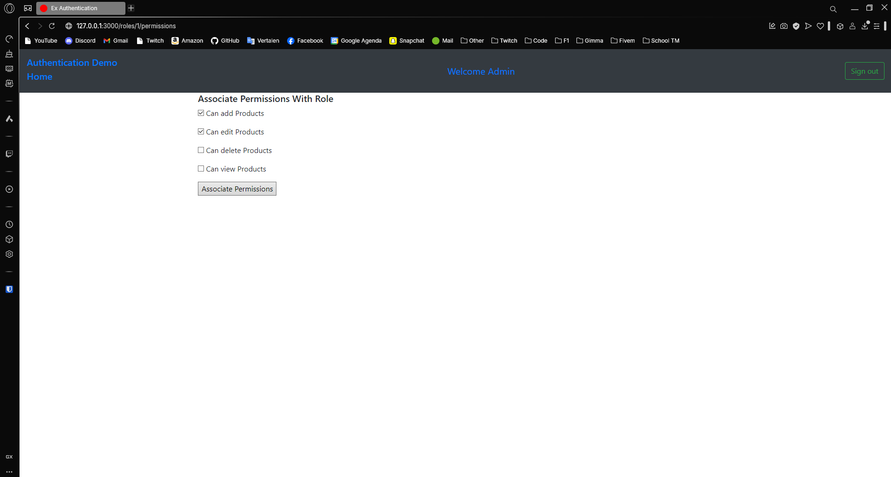

---
[⬅️ Vorige](./ReadMe-Section-30-31.md) • [🏠 Terug naar Hoofdpagina](../ReadMe.md) • [Volgende ➡️](./ReadMe-Section-33.md)
---

# Sectie 32 | Authentication

## 1. Gems instellen

```ruby
gem "toastr-rails"
gem "jquery-rails"
gem "rails-ujs"
gem "devise"
gem "pundit"
```

Initialize devise:

```ps
rails generate devise:install
```

## 2. Roles maken

```ps
rails g model role name:string

rails g controller roles
```

Rollen aanmaken:

```rb
Role.create(name: 'Customer')
Role.create(name: 'SuperUser')
```

## 3. Admin model

Admin aanmaken in db + alle files genereren

```ps
rails g devise admin
rails g migration AddRoleToAdmin

rails g devise:controllers admins
rails g devise:views admins
```

## 4. Relaties tussen de models

Ook de relatie op de role zetten.

```rb
enum admin_type: [ :super_admin, :customer, :staff_user ]

belongs_to :role, optional: true

before_save :manage_role

def manage_role
    if self.customer?
        self.role_id = 1
    end
end
```

## 5. Routes configureren

```ps
rails g controller customers

rails g controller staffUsers

rails g controller dashboard
```

```rb
devise_for :admins, controllers: { sessions: "admins/sessions", registrations: "admins/registrations" }

resources :roles
resources :staff_users
resources :customers, only: [ :edit, :update ]
resources :dashboard, only: [ :index ]
root "dashboard#index"
```

## 6. Layout aanpassen

De login notificaties toevoegen in de layout + een default navbar


## 7. Signup

Inloggen werkt met de superuser:


Aangepaste singup met meer fields:


Nieuwe user aangemaakt:


## 8. Wachtwoord aanpassen:


## 9. Profile updaten


## 10. Lijst van rollen voor superuser.

Een lijst met rollen voor de superuser:


Rolnaam aanpassen:


Rol toevoegen:


## 11. Permissions

```ps
rails g model permission name:string
rails g model permission_role role:references permission:references
```

Permissions toevoegen:




