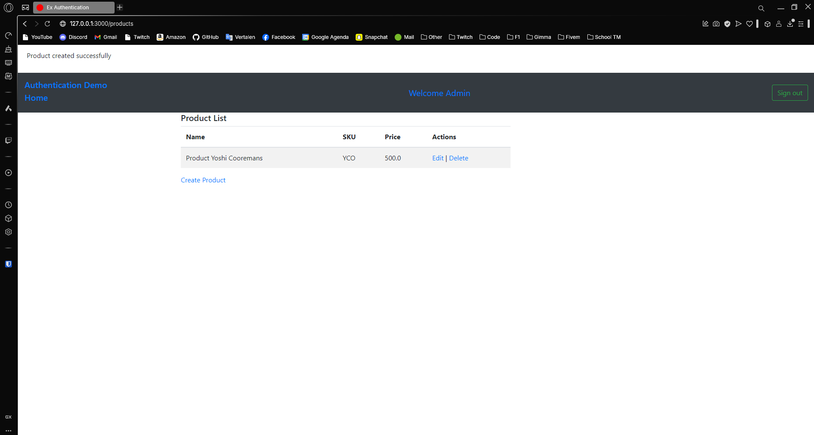
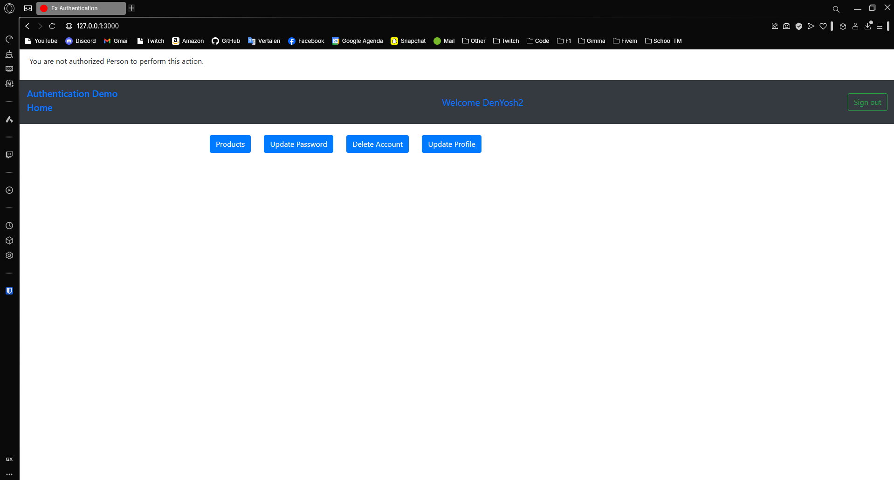

---
[⬅️ Vorige](./ReadMe-Section-32.md) • [🏠 Terug naar Hoofdpagina](../ReadMe.md) • [Volgende ➡️](./ReadMe-Section-34.md)
---

# Sectie 33 | Authorization

## 1. Installeren van pundit

```ps
rails g pundit:install
```

Pundit configureren

```rb
class ApplicationController < ActionController::Base
  # Only allow modern browsers supporting webp images, web push, badges, import maps, CSS nesting, and CSS :has.
  allow_browser versions: :modern
  include Pundit::Authorization

  rescue_from Pundit::NotAuthorizedError, with: :admin_not_authorized

    def admin_not_authorized
      flash[:alert] = "You are not authorized Person to perform this action."
      redirect_to root_path
    end

    # authorization context will be available to policies.
    def pundit_user
      current_admin
    end
end
```

## 2. Policy aanmaken

```ps
rails g pundit:policy product
```

```rb
attr_reader :admin

def initialize(admin,  record)
    @admin = admin
    @record = record
end

def create_product?
    # 1 means can add product
    admin.super_admin? || admin.role.permission_ids.include?(1)
end
```

## 3. Policy toevoegen aan de controller

Controller aanmaken:

```ps
rails g controller products index new create edit update destroy
```

In de method van de controller kun je de authorize gebruiken

```rb
authorize current_admin, :view_product?, policy_class: ProductPolicy
```

## 4. Voorbeeld:




