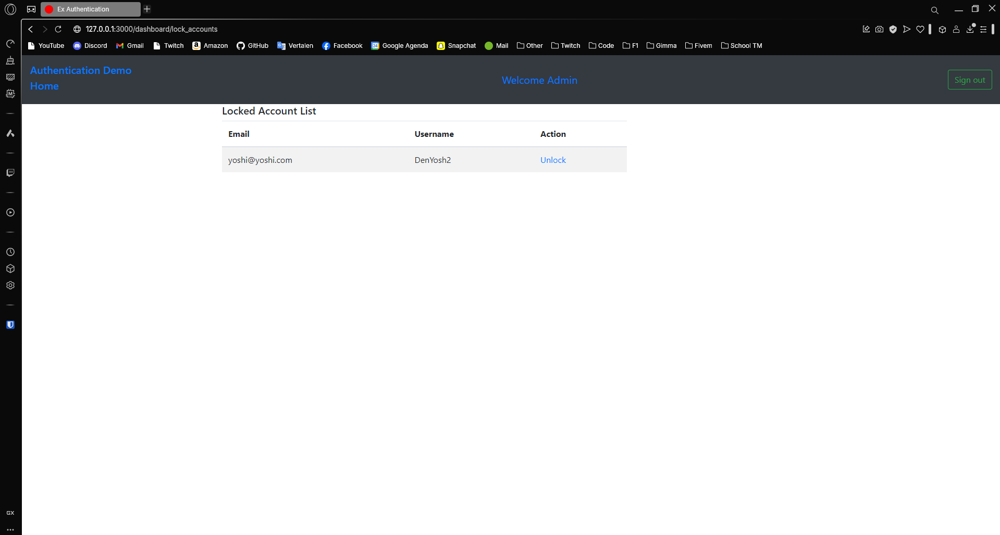

---
[⬅️ Vorige](./ReadMe-Section-33.md) • [🏠 Terug naar Hoofdpagina](../ReadMe.md) • [Volgende ➡️](./ReadMe-Section-35.md)
---

# Sectie 34 | Locking, Unlocking Users

## 1. Nieuwe migration toevoegen

```ps
rails g migration addTrackableAndLockableColumnsToAdmin
```

```rb
#Devise Tracking
add_column :admins, :sign_in_count, :integer, default: 0, null: false
add_column :admins, :current_sign_in_at, :datetime
add_column :admins, :last_sign_in_at, :datetime
add_column :admins, :current_sign_in_ip, :string
add_column :admins, :last_sign_in_ip, :string

#Devise Lockable
add_column :admins, :failed_attempts, :integer, default: 0, null: false
add_column :admins, :unlock_token, :string
add_column :admins, :locked_at, :datetime
```

## 2. Maximum aantal pogingen voor in te loggen


## 3. Lijst met gelockte accounts



Unlock een accounts


