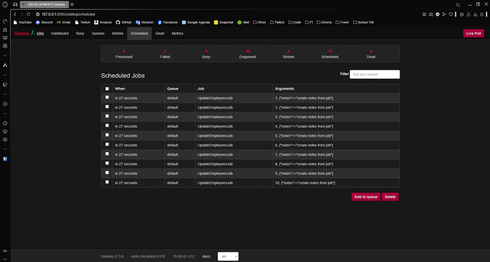
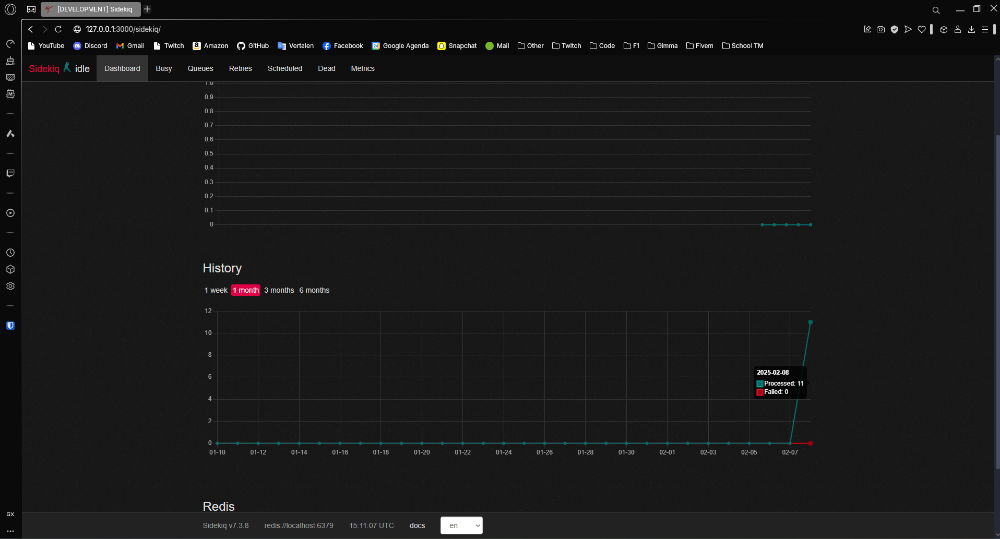
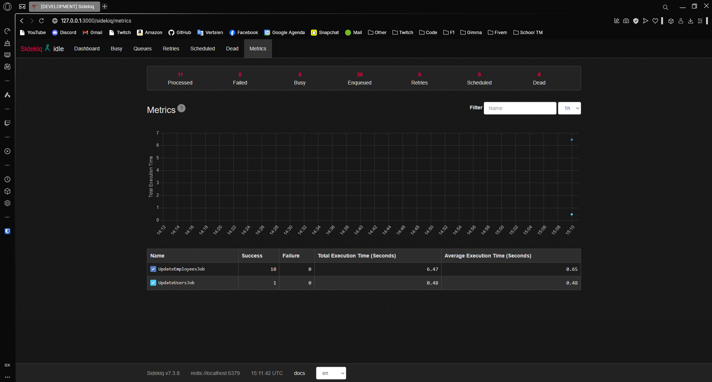

---
[⬅️ Vorige](./ReadMe-Section-34.md) • [🏠 Terug naar Hoofdpagina](../ReadMe.md) • [Volgende ➡️](./ReadMe-Section-36.md)
---

# Sectie 35 | Active jobs

## 1. Install Sidekiq gem

```ps
gem "redis"
gem "sidekiq"
gem "sidekiq-scheduler"

bundle binstub sidekiq
```

## 2. Models instellen

```ps
rails g model user_detail name:string profile:text

rails g model employee first_name:string last_name:string email:string notes:text
```

Ook hierbij de seeder voor het testen.

## 3. Job aanmaken

#### Eerste job:

```ps
rails g job update_employees
```

```rb
class UpdateEmployeesJob < ApplicationJob
  queue_as :default

  def perform(employee_id, attributes)
    employee = Employee.find(employee_id)
    employee.update(attributes)
  end
end
```

Iedere keer als de employee aangemaakt wordt of geupdate worden de notes automatisch geupdate.

```rb
class Employee < ApplicationRecord
  after_create :update_employee
  after_update :update_employee

  def update_employee
    UpdateEmployeesJob.set(wait: 1.minutes).perform_later(self.id, { notes: "create notes from job" }) if saved_changes.key?(:created_at)
    UpdateEmployeesJob.set(queue: "high_priority").perform_later(self.id, { notes: "update notes from job" }) if saved_changes.key?(:updated_at)
  end
end
```

#### Tweede job:

```ps
rails g job update_users
```

```rb
class UpdateUsersJob < ApplicationJob
  queue_as :default

  def perform
    UserDetail.update_all(profile: "profile from job")
  end
end
```

Dit zorgt ervoor dat de job iedere 5min wordt uitgevoerd.

config/sidekiq.yml

```yml
:queues:
    - critical
    - default
    - mailers

tasks: &tasks
    UpdateUsersJob:
        cron: "*/5 * * * *"
        queue: default
        description: "Update User profile"
:scheduler:
    :schedule:
        <<: *tasks
```

### 4. Configuratie

config/application.rb

```rb
config.active_job.queue_adapter = :sidekiq
```

config/routes.rb

```rb
require "sidekiq/web"

mount Sidekiq::Web => "/sidekiq"
```

config/initializers/redis.rb

```rb
$redis = Redis.new

Sidekiq.configure_server do |config|
  config.redis = { url: "redis://localhost:6379/0" }
end

Sidekiq.configure_client do |config|
  config.redis = { url: "redis://localhost:6379/0" }
end

$redis = Redis.new(url: "redis://localhost:6379/0")
```

config/initilizers/sidekiq.rb

```rb
require "sidekiq-scheduler"
```

## 5. Output







