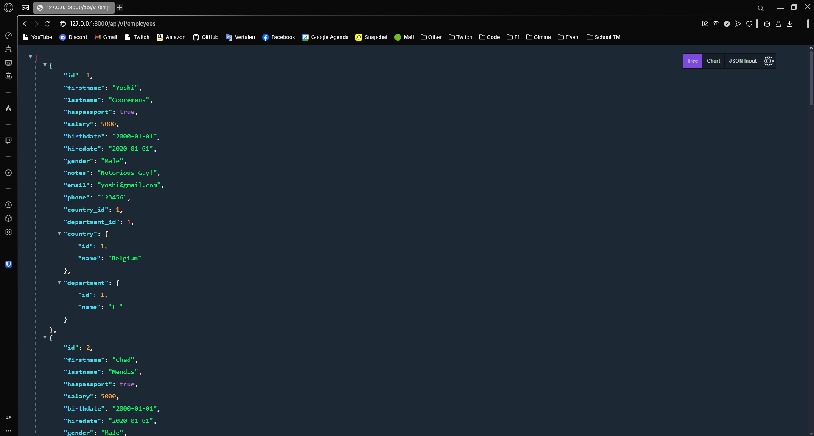
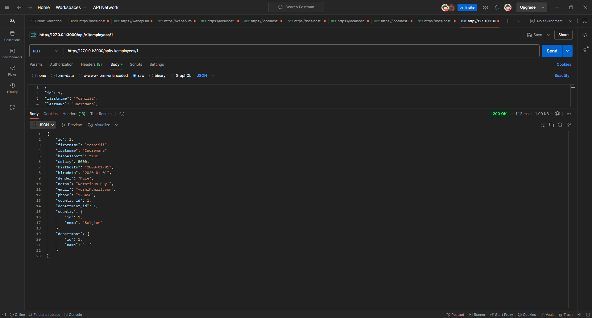

---
[⬅️ Vorige](./ReadMe-Section-35.md) • [🏠 Terug naar Hoofdpagina](../ReadMe.md) • [Volgende ➡️](./ReadMe-Section-37.md)
---

# Sectie 37 | Rest API

## 1. Configuration

Aanmaken project

```ps
rails new ex_employeerestapiprovider --api
```

Models, deze worden ook geseed

```ps
rails g model country name:string
rails g model department name:string
rails g model employee firstname:string lastname:string haspassport:boolean salary:integer birthdate:date hiredate:date gender:string notes:string email:string phone:string country:references department:references
```

## 2. Controllers

Waarom in de map api en v1? Omdat Rails documentation dit recommend als best practice.

```ps
rails g controller api/v1/Countries
rails g controller api/v1/Departments
rails g controller api/v1/Employees
```

Routes:

```rb
namespace :api do
namespace :v1 do
    resources :countries
    resources :departments
    resources :employees
end
end
```

## 3. CORS Configuration

```rb
Rails.application.config.middleware.insert_before 0, Rack::Cors do
  allow do
    origins "http://localhost:4000"

    resource "*",
      headers: :any,
      methods: [ :get, :post, :put, :patch, :delete, :options, :head ]
  end
end
```

## 4. Methods in de controller

Deze methods zijn relatief hetzelfde als een standaard Ruby on Rails method. Alleen is het enige verschil in plaats van dat je een view returnt met data, return je de json van de data.

Enkele voorbeelden van Employee:

```rb
# Alle waardes returnen
def index
    @employees = Employee.includes(:department, :country)
    render json: @employees status: :ok
end

# 1 Waarde returnen
def show
    render json: @employee
end

# Een record updaten
def update
    if @employee.update(employee_params)
        render json: @employee
    else
        render json: @employee.errors, status: :unprocessable_entity
    end
end

# Record verwijderen
def destroy
    @employee.destroy
    render json: { message: "Employee deleted successfully." }
end

# Record aanmaken
def create
    @employee = Employee.new(employee_params)

    if @employee.save
        render json: @employee, status: :created
    else
        render json: @employee.errors, status: :unprocessable_entity # 422
    end
end
```

## 5. Serializer voor nested relaties:

```rb
gem "active_model_serializers"
```

```ps
rails g serializer api/v1/department
rails g serializer api/v1/employee
rails g serializer api/v1/country
```

Aangepaste method met serializer

```rb
def index
    @employees = Employee.includes(:department, :country)
    render json: @employees, each_serializer: Api::V1::EmployeeSerializer,  status: :ok
end
```

## 6. Uitkomst:

Get:




Put:



Post:


Delete:


