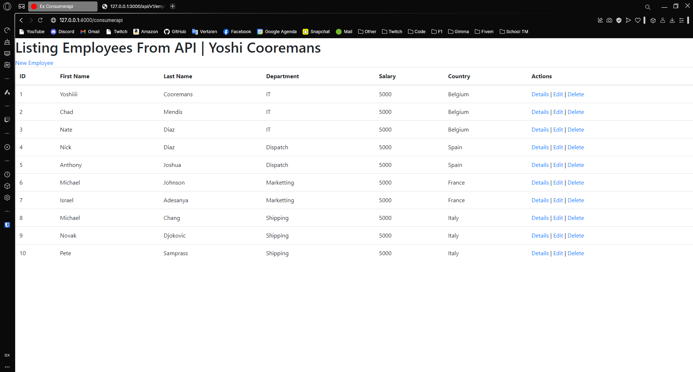
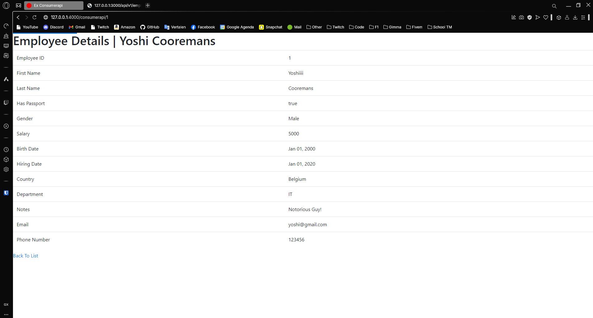
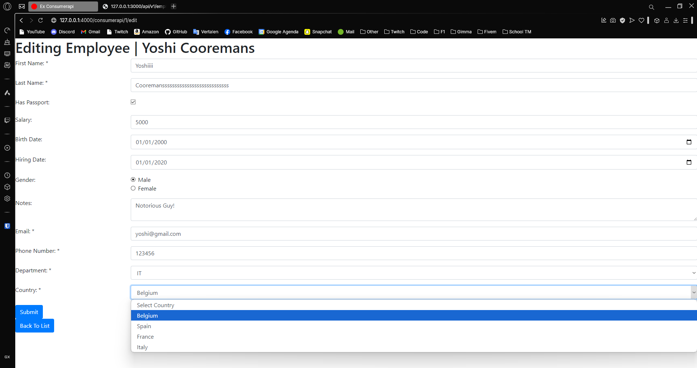
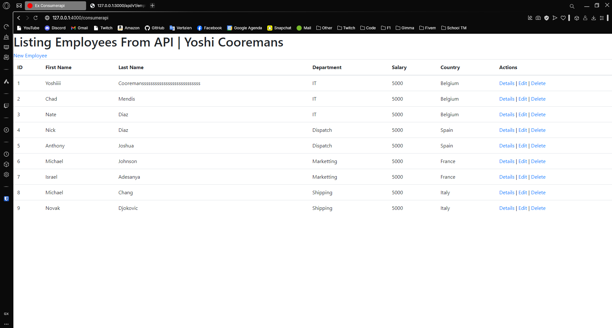

---
[⬅️ Vorige](./ReadMe-Section-36.md) • [🏠 Terug naar Hoofdpagina](../ReadMe.md) • [Einde ❌]
---

# Sectie 37 | Gebruiken van de API (Sectie 38)

## 1. Aanmaken controllers

```ps
rails g controller consumerapi
```

## 2. GET All

```rb
def index
    uri = URI("http://localhost:3000/api/v1/employees")
    response = Net::HTTP.get_response(uri)

    if response.is_a?(Net::HTTPSuccess)
    @employees = JSON.parse(response.body)
    else
    @error = "Failed to fetch data from API"
    end
end
```

## 3. Get 1 record

Deze method haalt de data op, deze wordt ook gebruikt bij het ophalen van de data bij edit.

```rb
def set_employee
    uri = URI("http://localhost:3000/api/v1/employees/#{params[:id]}")
    response = Net::HTTP.get_response(uri)

    if response.is_a?(Net::HTTPSuccess)
        @employee = JSON.parse(response.body)
    else
        flash[:error] = "Failed to fetch API response"
        redirect_to consumerapi_index_path
    end
end
```

## 4. PUT method

```rb
def update
    uri = URI("http://localhost:3000/api/v1/employees/#{params[:id]}")
    http = Net::HTTP.new(uri.host, uri.port)
    request = Net::HTTP::Patch.new(uri.path)

    employee_data = set_employee_params
    request.content_type = "application/json"
    request.body = employee_data.to_json
    response = http.request(request)

    if response.code == "422"
        @errors = JSON.parse(response.body)

        flash.now[:error] = @errors.values.flatten.join(", ")
        render :edit
    elsif response.is_a?(Net::HTTPSuccess)
        flash[:success] = "Employee updated successfully!"
        redirect_to consumerapi_index_path
    else
        flash[:error] = "Failed to update employee"
        render :edit
    end
end
```

## 5. Delete method

```rb
def destroy
    uri = URI("http://localhost:3000/api/v1/employees/#{params[:id]}")
    http = Net::HTTP.new(uri.host, uri.port)
    request = Net::HTTP::Delete.new(uri)

    response = http.request(request)

    if response.is_a?(Net::HTTPSuccess)
        flash[:success] = "Employee deleted successfully"
    else
        flash[:error] = "Failed to delete employee: #{response.message}"
    end
        redirect_to consumerapi_index_path
end
```

## 6. Post method

```rb
def create
    uri = URI("http://localhost:3000/api/v1/employees")
    http = Net::HTTP.new(uri.host, uri.port)
    request = Net::HTTP::Post.new(uri.path)

    employee_data = set_employee_params
    request.content_type = "application/json"
    request.body = employee_data.to_json
    response = http.request(request)

    if response.code == "422"
        @errors = JSON.parse(response.body)
        flash.now[:error] = @errors.values.flatten.join(", ")
        render :new
    elsif response.code == "201"
        flash[:success] = "Employee created successfully!"
        redirect_to consumerapi_index_path
    else
        flash[:error] = "Failed to create employee"
        render :new
    end
end
```

## 7. Voorbeelden








