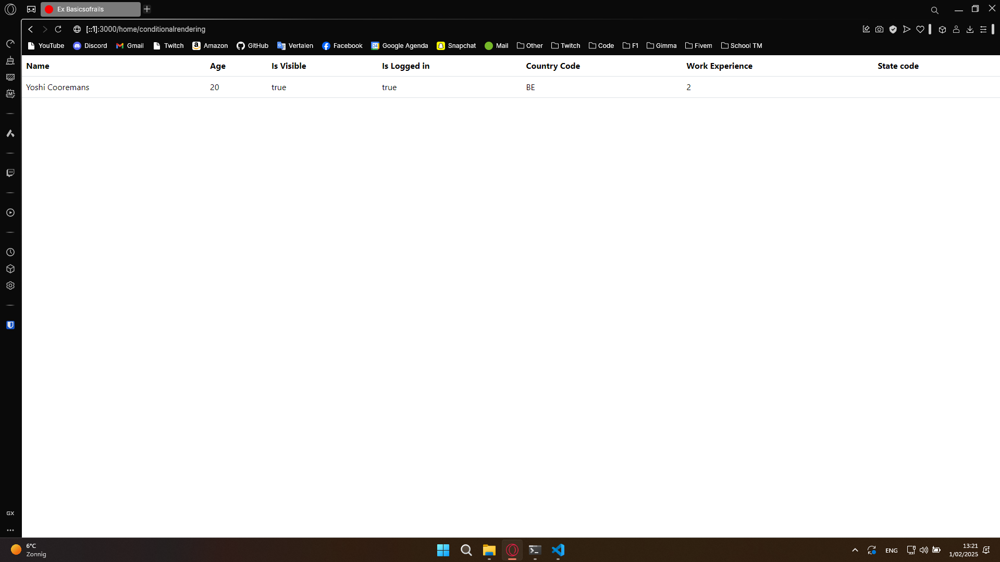
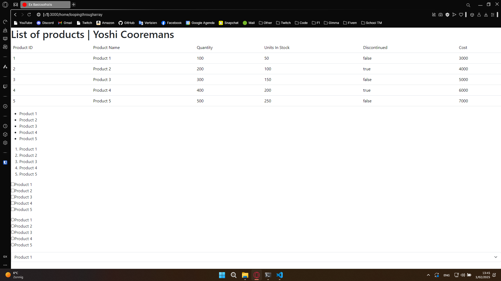
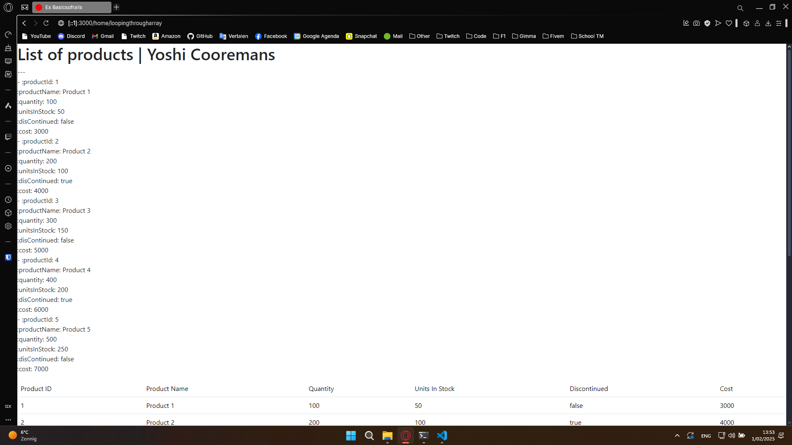
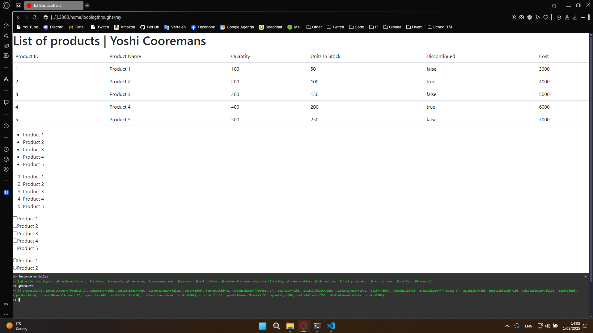

---
[⬅️ Vorige](./ReadMe-Section-3.md) • [🏠 Terug naar Hoofdpagina](../ReadMe.md) • [Volgende ➡️](./ReadMe-Section-7-8-9.md)
---

# Sectie 4 + 5

# Sectie 4 | Built in helper methods

## 1. Van de Controller naar de View met objects

Overzicht van een object (dictionary) naar de view, met bootstrap table.

## 2. If, else, ...

Verschillende if, else, ... in Ruby Rails.

## 3. Loop door data door .each method

# Sectie 5 | Debuggen

## 1. Data debuggen | View

Data debuggen door het weer te geven in de view doormiddel van de debug helper method.

## 2. Data debuggen | Server

Data debuggen door de Gem debugger te gebruiken in de console.

Data debuggen in de web console debugger.

## 3. Logging

Loggen van data of berichten met log levels.

