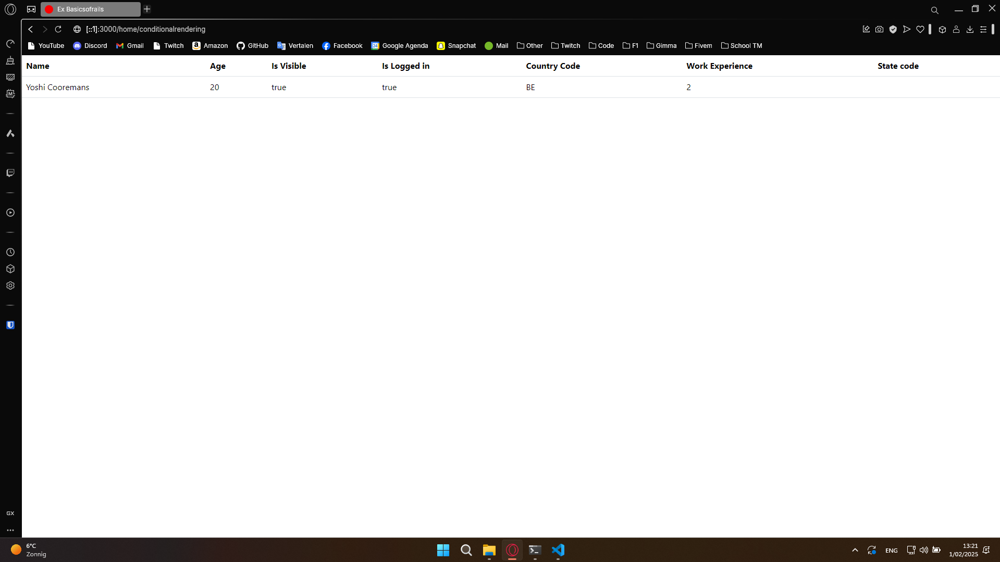
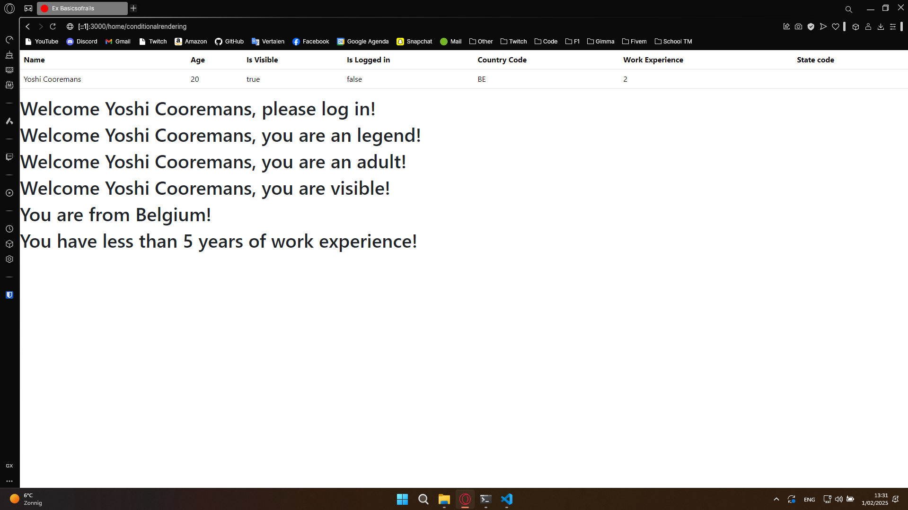
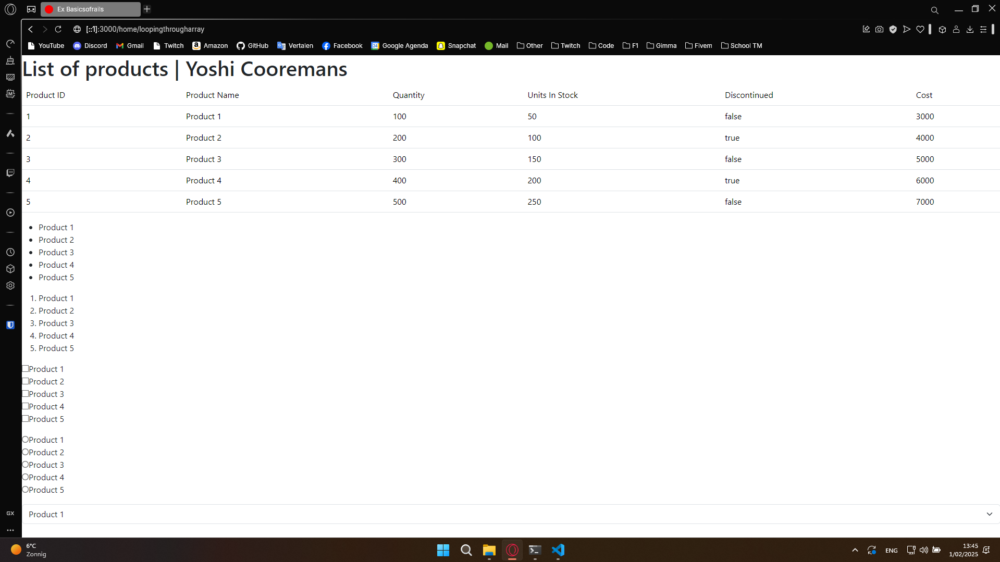
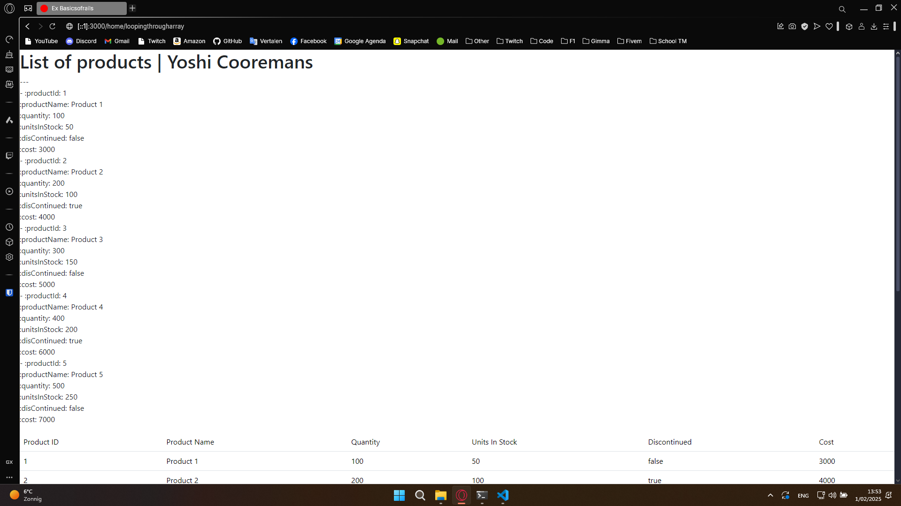
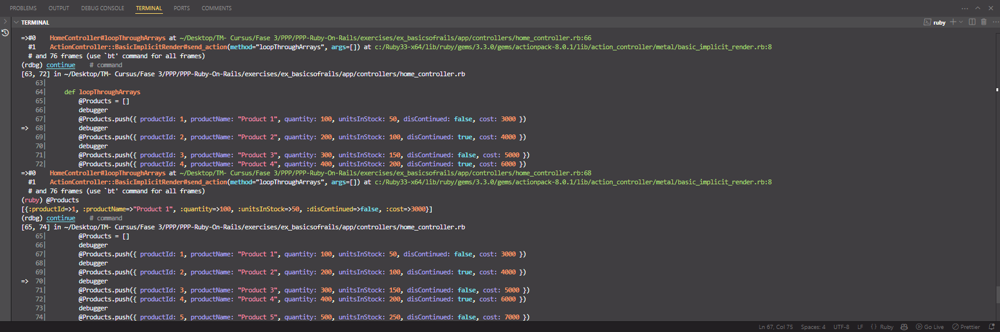
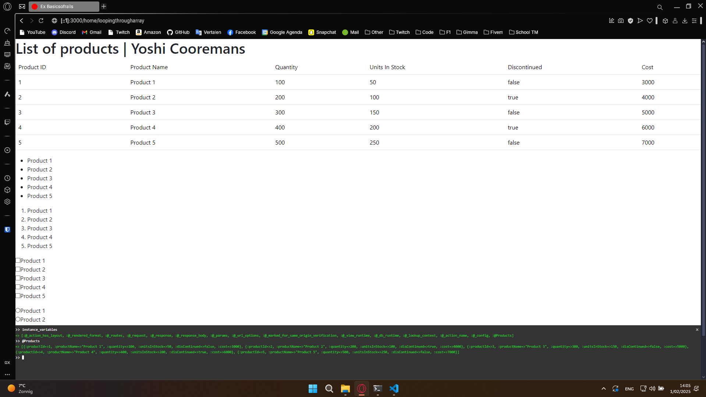

# Sectie 4 en 5

## 1. Van de Controller naar de View met objects

Overzicht van een object (dictionary) naar de view, met bootstrap table.

## 2. If, else, ...

Verschillende if, else, ... in Ruby Rails.

## 3. Loop door data door .each method

## 4. Data debuggen | View

Data debuggen door het weer te geven in de view doormiddel van de debug helper method.

## 5. Data debuggen | Server

Data debuggen door de Gem debugger te gebruiken in de console.

Data debuggen in de web console debugger.

