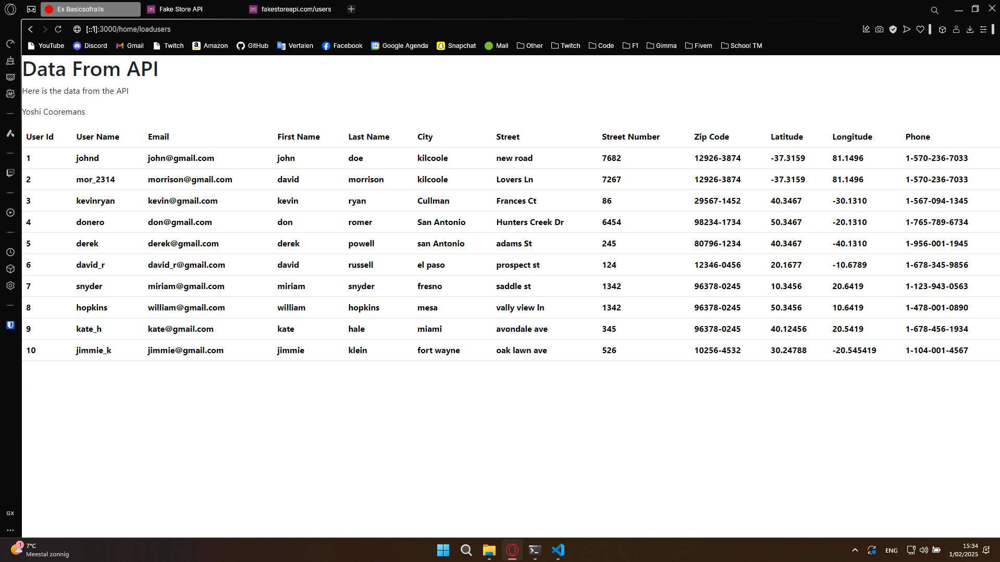
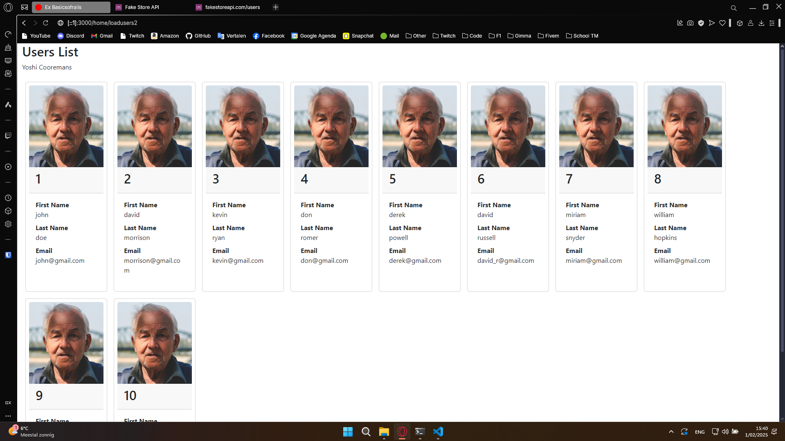
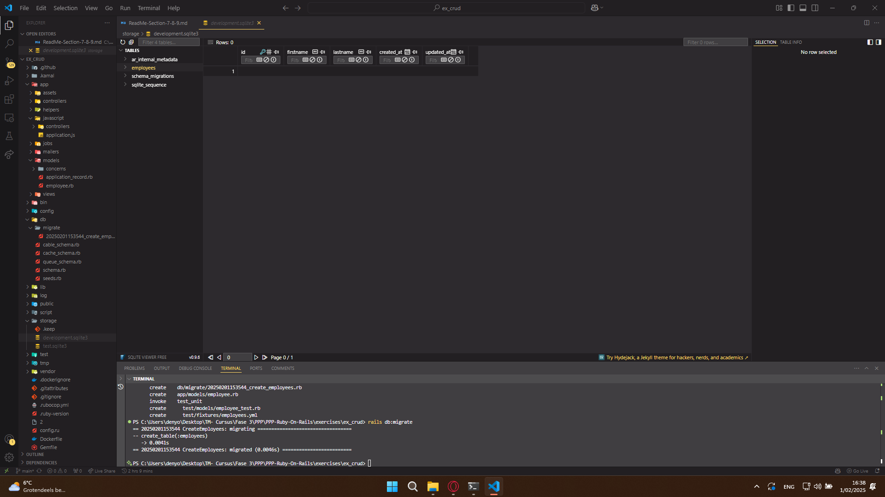

---
[⬅️ Vorige](./ReadMe-Section-4-5-6.md) • [🏠 Terug naar Hoofdpagina](../ReadMe.md) • [Volgende ➡️](./ReadMe-Section-10-11.md)
---

# Sectie 7 + 8 + 9

## 1. Data inladen van een RESTAPI

Hier laad in de data in van fakestoreapi.com

De data mooier ingeladen met een bootstrap card en willekeurige foto

## 2. Configuring SQLite3 Database

De SQLite3 database is aangemaakt met de bijhorende migration.

## 3. SQL Server opzetten

Ik heb de keuze gemaakt op SQLite3 te gebruiken i.p.v een SQL server, omdat SQLite3 voor te testen en dingen makkelijker en sneller is.
