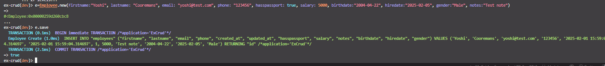
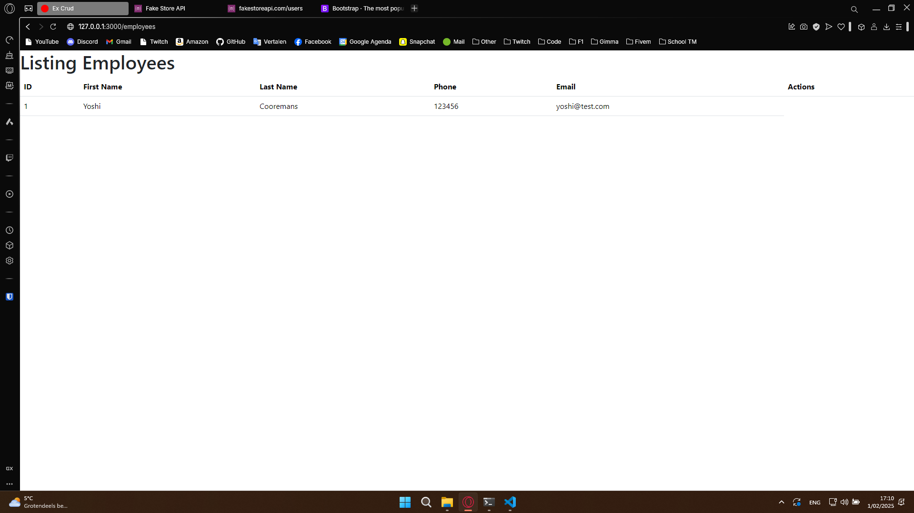

# Sectie 10

## 1. Aanmaken van een table

Het aanmaken van een table gebeurt door migrations. Dit is de output van 2 migrations.

```rb
ActiveRecord::Schema[8.0].define(version: 2025_02_01_155137) do
  create_table "employees", force: :cascade do |t|
    t.string "firstname"
    t.string "lastname"
    t.string "email"
    t.string "phone"
    t.datetime "created_at", null: false
    t.datetime "updated_at", null: false
    t.boolean "hasspassport"
    t.integer "salary"
    t.string "notes"
    t.date "birthdate"
    t.date "hiredate"
    t.string "gender"
  end
end
```

## 2. Data in de database via Rails console

Mezelf toegevoegd.



## 3. Data inladen via Rails


